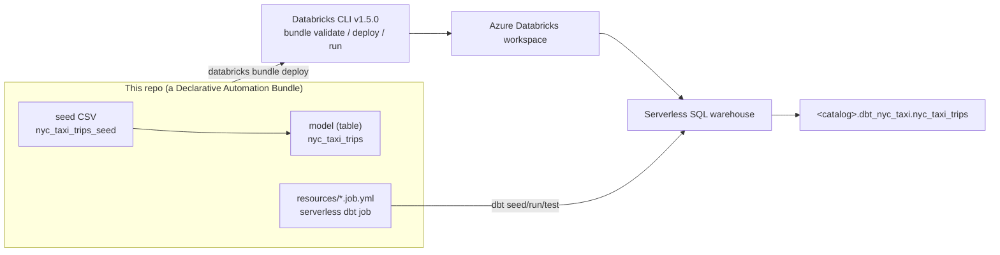

# bricks-cli — deploy a dbt project to Databricks with the new Databricks CLI

A small, **working** reference for deploying a dbt project to Azure Databricks
using the latest **Databricks CLI** and **Declarative Automation Bundles (DABs)** —
the bundle's *direct deployment* engine, so **no Terraform is required**.

The dbt scope is deliberately tiny so the deployment mechanics stay front and
centre: **one seed → one table.** A 100‑row extract of the public
`samples.nyctaxi.trips` table is committed as a dbt seed and materialized into a
Delta table by a single dbt model.



## Is a bundle still the way to go? (the research question)

**Yes.** Declarative Automation Bundles are the first‑party, recommended way to
package and deploy Databricks projects as code. The important 2025–2026 change is
that the latest CLI ships a **direct deployment** engine, so a bundle deploy no
longer shells out to Terraform — exactly what this repo's name asks for. Details
and sources are in [docs/03-asset-bundles.md](docs/03-asset-bundles.md).

## Repository layout

```
.
├── databricks.yml                  # bundle definition + dev/prod targets
├── resources/
│   └── nyc_taxi.job.yml             # serverless job that runs the dbt task
├── dbt_project.yml                 # dbt project (paths under src/)
├── dbt_profiles/
│   └── profiles.yml                # dbt profile for local runs (env‑var based)
├── profile_template.yml            # prompts for `dbt init` (local profile)
├── requirements-dev.txt            # dbt-databricks adapter (local dev)
├── src/
│   ├── seeds/nyc_taxi/             # the seed CSV + its properties
│   └── models/nyc_taxi/           # the single table model + tests
├── .github/workflows/             # secretless OIDC CI + deploy
├── docs/                           # the guide (start here ↓)
└── .agents/skills/                # installed dbt agent skills
```

## Quickstart

Prerequisites: the Databricks CLI (see [docs/01](docs/01-databricks-cli.md)) and an
authenticated session (see [docs/02](docs/02-authentication.md)). Workspace‑specific
values are never committed — supply them as env vars (locally) or GitHub Variables
(in CI); see [docs/05](docs/05-deploy-and-run.md). Then, from the repo root:

```bash
export DATABRICKS_HOST="https://adb-XXXXXXXXXXXX.NN.azuredatabricks.net"
export BUNDLE_VAR_warehouse_id="<your-warehouse-id>"
export BUNDLE_VAR_catalog="<your-catalog>"

databricks bundle validate --target dev   # check the config
databricks bundle deploy   --target dev   # upload + create the job (no Terraform)
databricks bundle run nyc_taxi_dbt_job --target dev   # seed → table → test
```

Want to iterate on the models locally first? See
[docs/04-dbt-on-databricks.md](docs/04-dbt-on-databricks.md).

## Documentation

All docs are written against [databricks/cli](https://github.com/databricks/cli)
concepts and were peer‑reviewed for accuracy.

| Doc | What it covers |
|-----|----------------|
| [01 – The Databricks CLI](docs/01-databricks-cli.md) | What the CLI is, install the latest version, command groups, config/profiles |
| [02 – Authentication](docs/02-authentication.md) | Unified auth, Azure CLI login, profiles, env vars, OAuth/PAT, OIDC |
| [03 – Asset Bundles](docs/03-asset-bundles.md) | DAB anatomy, direct deployment vs Terraform, targets, deployment modes |
| [04 – dbt on Databricks](docs/04-dbt-on-databricks.md) | The `dbt-databricks` adapter, seed→table, the serverless dbt task |
| [05 – Deploy & run](docs/05-deploy-and-run.md) | End‑to‑end deploy/run + **secretless CI/CD with GitHub OIDC** |

## dbt agent skills

The official [dbt-labs/dbt-agent-skills](https://github.com/dbt-labs/dbt-agent-skills)
are installed under `.agents/skills/` so AI agents working in this repo can use
them. See [docs/04-dbt-on-databricks.md](docs/04-dbt-on-databricks.md#dbt-agent-skills).

## What was verified

This is not a paper example — it was run against a live workspace:

- `databricks bundle validate` → OK for `dev` and `prod`.
- `databricks bundle deploy --target dev` → job created via direct deployment.
- `databricks bundle run nyc_taxi_dbt_job --target dev` → the serverless dbt job
  finished `TERMINATED SUCCESS`.
- `dbt seed/run/test` → 100 rows loaded, `nyc_taxi_trips` table built, tests pass.
