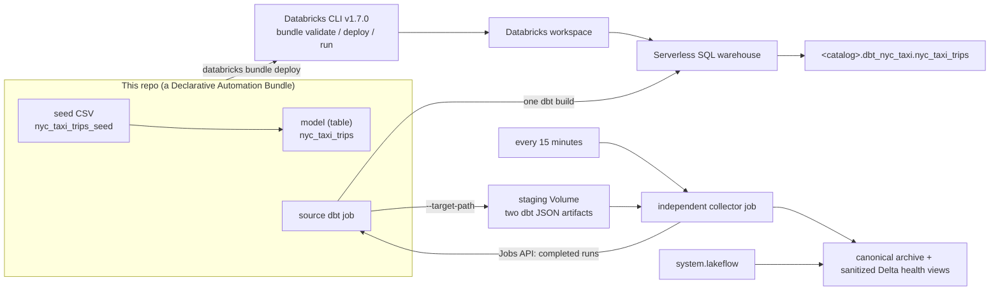

# bricks-cli — deploy a dbt project to Databricks with the new Databricks CLI

A small, end-to-end reference for deploying a dbt project to Azure Databricks
using the latest **Databricks CLI** and **Declarative Automation Bundles (DABs)** —
the bundle's *direct deployment* engine, so **no Terraform is required**.

The dbt scope is deliberately tiny so the deployment mechanics stay front and
centre: **one seed → one table.** A 100‑row extract of the public
`samples.nyctaxi.trips` table is committed as a dbt seed and materialized into a
Delta table by a single dbt model.

The project also demonstrates a **Databricks-only observability path** suitable
for regulated environments: dbt stages `manifest.json` and `run_results.json`
in a restricted Unity Catalog Volume, an independent collector creates a
deterministic content-addressed archive, and operators use sanitized Delta views
joined to Lakeflow system tables. No external telemetry platform or
cloud-specific monitoring service is required, and dbt anonymous usage
reporting is disabled.

📖 **Documentation site:** <https://miguelelgallo.github.io/bricks-cli/> —
structured with [Diátaxis](https://diataxis.fr/) (Tutorial · How‑to · Reference ·
Explanation) and built with [Zensical](https://zensical.org/). The Markdown
sources live in [`docs/`](docs/).



## Is a bundle still the way to go? (the research question)

**Yes.** Declarative Automation Bundles are the first‑party, recommended way to
package and deploy Databricks projects as code. The important 2025–2026 change is
that the latest CLI ships a **direct deployment** engine, so a bundle deploy no
longer shells out to Terraform — exactly what this repo's name asks for. Details
and sources are in
[Why Declarative Automation Bundles](docs/explanation/why-asset-bundles.md).

## How observability works

The source job runs `dbt build --select +nyc_taxi_trips` and uses
`--target-path` to write `manifest.json` and `run_results.json` into a staging
leaf keyed by workspace, job, run, repair, task run, and execution. It contains
no collector task, so its result reflects dbt directly.

A second job runs every 15 minutes, lists completed source runs, and reconciles
matching staging leaves. It packages exactly those two JSON files into a
deterministic tar, stores the tar under its SHA-256 in a collector-only evidence
Volume, writes allowlisted invocation/node facts, and then deletes staging.
Capture and cleanup failures belong to the collector alert; they never change
the already-terminal source result.

The managed Volume controls are application-level tamper-evident, not WORM.
The collector uses governed sequential `/Volumes/...` I/O and has no external
or Azure-native telemetry/storage dependency.

The top-level serverless dependencies are pinned: `dbt-core==1.11.11`,
`dbt-databricks==1.12.2`, and `databricks-sdk==0.117.0`. These direct pins are
not a complete transitive lockfile guarantee. Follow the
[observability runbook](docs/how-to/observe-dbt-jobs.md) for permissions,
configuration, queries, forced-failure verification, and safe cleanup.

## Repository layout

```
.
├── databricks.yml                  # bundle definition + dev/prod targets
├── resources/
│   ├── nyc_taxi.job.yml             # source dbt job
│   ├── dbt_observability_collector.job.yml # scheduled collector job
│   └── observability.infrastructure.yml # UC schema + staging/evidence Volumes
├── dbt_project.yml                 # dbt project (paths under src/)
├── dbt_profiles/
│   └── profiles.yml                # dbt profile for local runs (env‑var based)
├── profile_template.yml            # prompts for `dbt init` (local profile)
├── requirements-dev.txt            # exact dbt, SDK, test, lint, and type pins
├── requirements-docs.txt           # Zensical (builds the docs site)
├── zensical.toml                   # documentation site configuration
├── src/
│   ├── seeds/nyc_taxi/             # the seed CSV + its properties
│   ├── models/nyc_taxi/            # the single table model + tests
│   └── observability/              # artifact validation + normalization
├── tests/                          # isolated collector security/unit tests
├── .github/workflows/             # OIDC CI + deploy, and docs → Pages
├── docs/                           # documentation site sources (Diátaxis)
└── .agents/skills/                # installed dbt agent skills
```

## Quickstart

Prerequisites: the Databricks CLI (see
[Install the CLI](docs/tutorials/install-the-cli.md)) and an authenticated
session (see [Connect to Databricks](docs/tutorials/connect-to-databricks.md)).
Supply workspace‑specific values as env vars (locally) or GitHub Variables (in
CI); see
[Configuration values](docs/reference/configuration-values.md). Then, from the
repo root — these commands authenticate from the env vars above, so they need no
`-p` profile flag:

```bash
export DATABRICKS_HOST="https://adb-XXXXXXXXXXXX.NN.azuredatabricks.net"
export DATABRICKS_AUTH_TYPE="azure-cli"   # reuse your `az login` session
export BUNDLE_VAR_warehouse_id="<your-warehouse-id>"
export BUNDLE_VAR_catalog="<your-catalog>"
export BUNDLE_VAR_schema="dbt_nyc_taxi_dev"
export BUNDLE_VAR_observability_schema="dbt_observability"
export BUNDLE_VAR_observability_staging_volume="dbt_artifacts_staging"
export BUNDLE_VAR_observability_volume="dbt_artifacts"

databricks bundle validate --target dev   # check the config
databricks bundle deploy   --target dev   # upload + create both jobs (no Terraform)
databricks bundle run nyc_taxi_dbt_job --target dev   # run the source dbt build
```

Want to iterate on the models locally first? See
[Run dbt locally](docs/how-to/run-dbt-locally.md).

## Documentation

The full guide is a [Zensical](https://zensical.org/) site published to GitHub
Pages and organized with the [Diátaxis](https://diataxis.fr/) framework. It's
written against [databricks/cli](https://github.com/databricks/cli) concepts.

👉 **<https://miguelelgallo.github.io/bricks-cli/>**

| Section | What it covers |
|---------|----------------|
| [Tutorial – User Guide](docs/tutorials/index.md) | A guided, FastAPI‑style path from zero to a deployed, running dbt job |
| [How‑to guides](docs/how-to/index.md) | Run dbt locally, observe jobs, set up OIDC CI/CD, deploy to prod |
| [Reference](docs/reference/index.md) | CLI commands, bundle config, the dbt job resources, every config value, layout |
| [Explanation](docs/explanation/index.md) | Why bundles, the auth model, how dbt connects, keeping secrets out of git |

Build the site locally with `pip install -r requirements-docs.txt && zensical serve`.

## dbt agent skills

The official [dbt-labs/dbt-agent-skills](https://github.com/dbt-labs/dbt-agent-skills)
are installed under `.agents/skills/` so AI agents working in this repo can use
them. See
[Project layout → dbt agent skills](docs/reference/project-layout.md#dbt-agent-skills).
