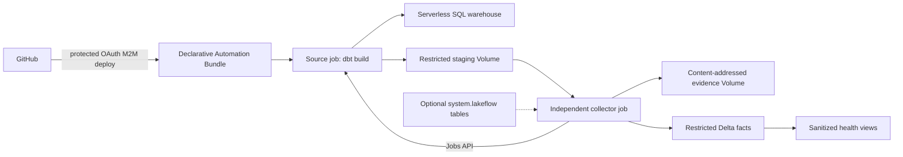

# bricks-cli

Deploy a small dbt Core project and observe every task attempt using only
Databricks-native controls. The repository contains one seed, one Delta table,
two serverless Lakeflow Jobs, governed artifact evidence, sanitized health
views, and a protected GitHub deployment workflow.

The live reference deployment is validated on an **AWS Databricks Free Edition**
workspace with Databricks CLI `1.7.0`, dbt Core `1.11.11`, and
`dbt-databricks` `1.12.2`. It has no Azure-native dependency and no external
telemetry platform.

> [!IMPORTANT]
> Free Edition is for learning and non-commercial validation. It has no
> compliance enforcement, private networking, account-level APIs, SLA, or
> support commitment. The architecture demonstrates controls that can be
> adapted to an approved regulated environment; this personal workspace is not
> itself a regulated production environment.
>
> Use only the included public demonstration data. Do not upload Personal Data,
> confidential, proprietary, or regulated data to Free Edition: Databricks
> describes it for exploratory datasets and reserves the right to train on
> uploaded data.

## What it proves

- A Declarative Automation Bundle deploys dbt without Terraform.
- A source job runs `dbt build` under a dedicated service principal.
- Each instrumented attempt has a unique staging path. Produced
  `manifest.json` / `run_results.json` pairs are captured, and absence is
  recorded explicitly.
- An independent collector stores a deterministic, SHA-256-addressed archive,
  writes allowlisted Delta facts, and deletes staging.
- Source-job status stays independent from evidence-capture status.
- Two health views are always created; three `system.lakeflow` views are added
  when the collector is allowed to read those system tables.
- GitHub pull-request CI is credential-free. Production deployment uses a
  protected, rotating workspace OAuth M2M secret because Free Edition cannot
  create the account-level federation policy required for GitHub OIDC.



## Start here

The documentation site is
**[miguelelgallo.github.io/bricks-cli](https://miguelelgallo.github.io/bricks-cli/)**.
It follows [Diátaxis](https://diataxis.fr/) and uses the progressive,
example-first rhythm of the [FastAPI documentation](https://fastapi.tiangolo.com/learn/).
The documentation home is the canonical source for supported authentication,
architecture, operating procedures, and product boundaries; this README is the
repository orientation.

- [Tutorial](docs/tutorials/index.md): authenticate, deploy, run, and observe the
  first capture.
- [How-to guides](docs/how-to/index.md): perform a specific development,
  deployment, monitoring, or recovery task.
- [Reference](docs/reference/index.md): exact commands, variables, resources,
  schemas, states, errors, permissions, and limits.
- [Explanation](docs/explanation/index.md): understand the design choices,
  security boundary, and evidence lifecycle.

## Repository map

```text
databricks.yml                         bundle targets, variables, and grants
resources/nyc_taxi.job.yml             source dbt job
resources/dbt_observability_collector.job.yml
resources/observability.infrastructure.yml
src/models/ and src/seeds/             one seed-to-table dbt graph
src/observability/                      collector and artifact parser
tests/                                  isolated collector and policy tests
.github/workflows/                      credential-free CI, protected deploy, Pages
docs/                                   Diátaxis documentation sources
```

## Local quality gates

```bash
ruff check .
ruff format --check .
ty check
pytest
uv tool run --from zensical==0.0.46 zensical build --clean --strict
```

See [Project layout](docs/reference/project-layout.md) for the complete map and
[Runtime versions](docs/reference/runtime-versions.md) for the reviewed pins.
