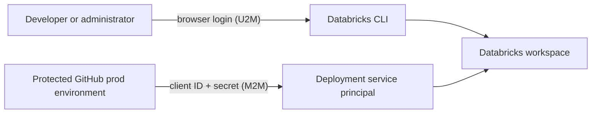

# The authentication model

This repository uses two Databricks OAuth flows for two different actors:

- a person signs in locally with **OAuth user-to-machine (U2M)**; and
- GitHub Actions signs in as the deployment service principal with
  **OAuth machine-to-machine (M2M)**.

Both flows use
[Databricks unified authentication](https://docs.databricks.com/aws/en/dev-tools/auth/).
The difference is who authenticates and where the credential is held.

## One workspace, two authentication paths

### Local work uses OAuth U2M

`databricks auth login` opens a browser, completes an interactive workspace
login, and caches the resulting OAuth state locally. By default, current CLI
versions use the operating system's secure credential store. A plaintext file
fallback can be configured; when it is, that file must be protected as
credential-bearing local state. The profile names the workspace and lets later
CLI commands refresh a short-lived token without placing a PAT in the
repository.

The cached login belongs to the human who completed the browser flow. It is
appropriate for local administration and development, not unattended CI.
Follow [Connect to Databricks](../tutorials/connect-to-databricks.md) for the
login procedure, and use
[Authentication support](../reference/authentication-support.md) for the exact
CLI contract.

### Production deployment uses OAuth M2M

The production workflow explicitly selects OAuth M2M and supplies the workspace
host, deployer application ID, and protected client secret through GitHub. The
host and application ID are configuration; the client secret is a reusable
credential stored only in the protected GitHub `prod` environment. GitHub
releases an environment secret to a job only after the environment's protection
rules have passed. See
[Deployments and environments](https://docs.github.com/en/actions/reference/workflows-and-actions/deployments-and-environments).

M2M authenticates the **deployer**. It does not make every Databricks job run as
that identity. The bundle assigns the source and collector jobs their own
`run_as` service principals.

The exact variables belong to
[Configuration values](../reference/configuration-values.md); the protected
environment procedure belongs to
[Set up OAuth M2M CI/CD](../how-to/set-up-m2m-cicd.md).

## Why GitHub OIDC is not used here

Databricks can exchange a GitHub OIDC token through workload identity
federation. Configuring that trust requires an account-level service-principal
federation policy. This personal Free Edition workspace has no account console
or account APIs, so that policy cannot be configured here.

That is a Free Edition capability boundary, not a limitation caused by using a
personal email address. Workspace OAuth U2M and workspace service-principal M2M
remain usable. See the official
[GitHub federation setup](https://docs.databricks.com/aws/en/dev-tools/auth/provider-github)
and
[Free Edition limitations](https://docs.databricks.com/aws/en/getting-started/free-edition-limitations).

The Free Edition page's email OTP, Google, and Microsoft list describes the
available interactive sign-in providers and the absence of enterprise SSO/SCIM.
It does not prohibit workspace API OAuth after sign-in: U2M and M2M were both
validated against this workspace. Account-level federation remains the missing
capability.

If the project later moves to a Databricks account with account-level identity
federation, OIDC can replace the deployer secret after a separate migration and
verification. It is not the current authentication path.

## How unified authentication chooses credentials

The CLI can read a host and credentials from environment variables or a profile
in `~/.databrickscfg`. Explicitly selecting the intended source prevents a local
profile, PAT, or automation credential from winning unexpectedly. Local work
selects the U2M profile; protected automation pins OAuth M2M.

The bundle deliberately omits the workspace host. Authentication context
therefore selects the workspace without committing a workspace-specific URL.

## CLI authentication and dbt authentication are related, not identical

The CLI uses U2M or M2M to call workspace APIs. A deployed Databricks `dbt_task`
runs with its assigned service principal and receives a generated dbt
connection. A local dbt Core process instead reads `DBT_*` environment
variables, including a short-lived token obtained from the U2M cache.

The complete connection path is explained in
[How dbt connects to Databricks](how-dbt-connects.md).

The repository deliberately maps one authentication method to each actor instead
of treating PAT, M2M, and OIDC as interchangeable fallbacks. The canonical
support matrix is in
[Authentication support](../reference/authentication-support.md). For general
CLI behavior, see
[Authenticate the Databricks CLI](https://docs.databricks.com/aws/en/dev-tools/cli/authentication).
