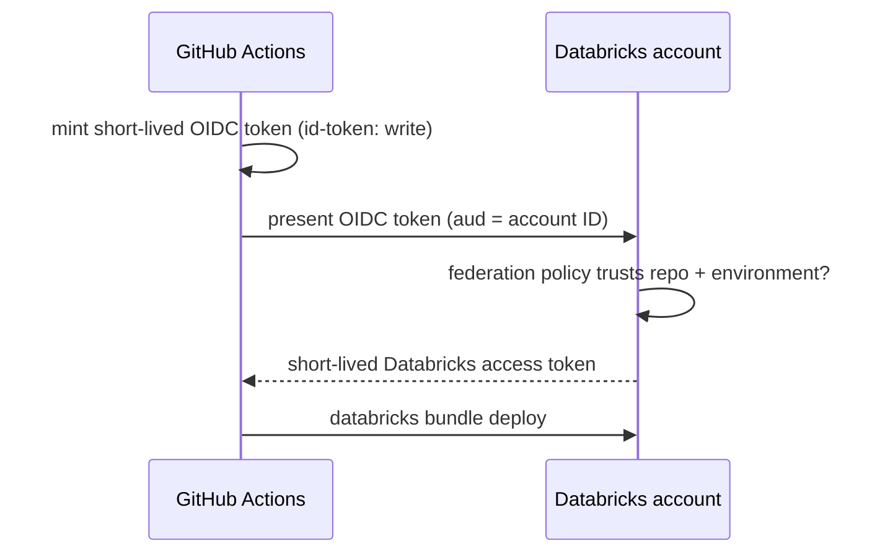

# The authentication model

The Databricks CLI follows **Databricks Unified Authentication**: every command
(and every bundle deploy) looks for credentials in the same well-defined order,
so the same configuration works locally, in scripts, and in CI.

## How the CLI finds credentials

In order, the CLI uses the first of these that is complete:

1. **Bundle settings files** — for commands run from a bundle working directory
   (e.g. `targets.<name>.workspace.host` in `databricks.yml`). These select the
   host/target but never store credentials directly.
2. **Environment variables** — `DATABRICKS_HOST`, `DATABRICKS_TOKEN`,
   `DATABRICKS_CLIENT_ID` / `DATABRICKS_CLIENT_SECRET`, `DATABRICKS_AUTH_TYPE`, …
3. **A profile** in `~/.databrickscfg` (selected by `--profile`/`-p`, else
   `DEFAULT`).

Cloud-native methods are **not** a separate tier: they're chosen *within* steps
2–3 via `auth_type`. For Azure that includes `azure-cli` (reuse your `az`
session), `azure-msi` (managed identity), and Microsoft Entra ID service
principals (OAuth M2M). A host plus *one* valid credential source is all that's
needed.

## What this repo uses locally: Azure CLI auth

Because the workspace is Azure Databricks and you're already signed in to Azure,
the simplest local setup lets the CLI reuse your `az` login — **no tokens to
store**:

```ini title="~/.databrickscfg"
[bricks-demo]
host      = https://adb-XXXXXXXXXXXX.NN.azuredatabricks.net
auth_type = azure-cli
```

`auth_type = azure-cli` makes the CLI mint short-lived Microsoft Entra ID tokens
from your `az` session on demand. The profile stores only a host and a *method* —
nothing secret.

## What this repo uses in CI: GitHub OIDC

In GitHub Actions there's no `az` session, so the workflows use **Workload
Identity Federation** instead:



No PAT or client secret is stored. The trust is scoped to one repo + environment,
and tokens expire in minutes. Setup is in
[Set up secretless CI/CD with OIDC](../how-to/set-up-oidc-cicd.md).

## Credential options at a glance

| Method | Stores a secret? | Best for |
|--------|------------------|----------|
| **Azure CLI** (`auth_type = azure-cli`) | No | Local dev on Azure (this repo) |
| **OAuth U2M** (`databricks auth login`) | No (browser sign-in, cached) | Local dev, any cloud |
| **OAuth M2M** (service principal id + secret) | Yes (secret) | Automation without OIDC |
| **GitHub OIDC** (`auth_type = github-oidc`) | **No** | CI/CD (this repo) |
| **PAT** (personal access token) | Yes (token) | Quick tests; least preferred |

## Profiles vs. environment variables

- **Profiles** (`~/.databrickscfg`) are convenient for humans juggling several
  workspaces. Select one with `-p/--profile`, or set
  `DATABRICKS_CONFIG_PROFILE=bricks-demo`.
- **Environment variables** are best for CI and containers. For a bundle, set
  `DATABRICKS_HOST` and one credential; bundles also honor
  `DATABRICKS_BUNDLE_TARGET` to pick the target (the older `DATABRICKS_BUNDLE_ENV`
  is a deprecated alias).

## dbt's connection is separate

The CLI auth above is for **deploying** the bundle. The dbt **adapter** has its
own connection — covered in
[How dbt connects to Databricks](how-dbt-connects.md). The short version: the
deployed job gets credentials injected by Databricks; local runs read env vars.
