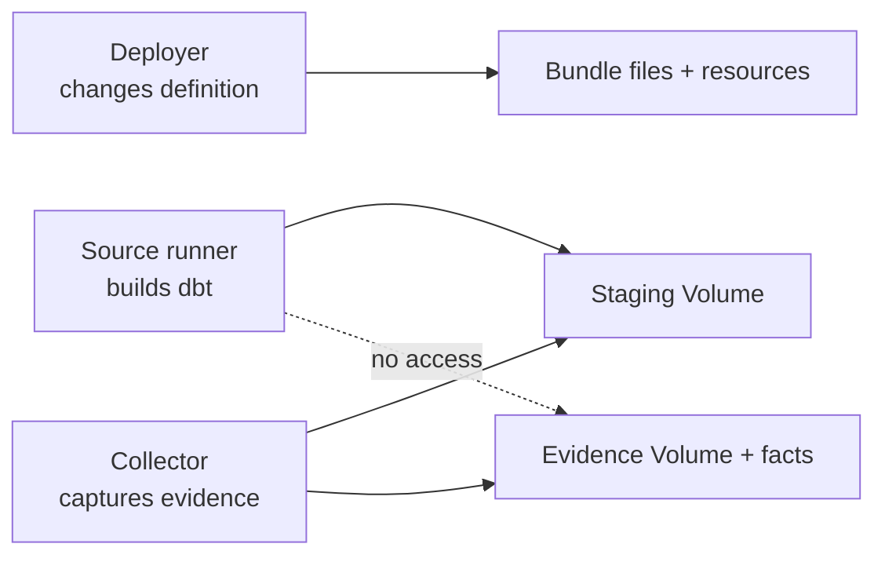

# Development and production are different controls

The `dev` and `prod` bundle targets change deployment behavior. They do not,
by themselves, make two data environments safe.

## What development mode changes

The default `dev` target uses development mode. Databricks prefixes resource
names with the current user, isolates bundle deployment state, and pauses job
schedules. The jobs can be run manually while configuration is being tested.

Development deliberately does not set service-principal `run_as` overrides, so
manual jobs run under the deploying user's permitted context.

## What production mode changes

The `prod` target uses:

- stable resource names and a stable root beneath the deployer principal's home;
- a deployer service principal with bundle `CAN_MANAGE`;
- a dedicated source-runner `run_as` identity;
- a separate collector `run_as` identity;
- an unpaused 15-minute collector schedule;
- production-specific schema naming; and
- `prevent_destroy` on the observability schema and both Volumes.

After deployment, CI also grants the runner `CAN_READ` and collector `CAN_RUN`
on the deployed files directory. That post-deploy ACL is part of the production
contract.

## What neither mode changes automatically

Both targets use the values supplied for:

- SQL warehouse;
- dbt target catalog and schema;
- observability catalog;
- notification recipients; and
- duration threshold.

Pointing both modes at the same writable dbt schema defeats data isolation even
if their job names differ. Use development-specific warehouse/catalog/schema
values and lower-risk data.

## Production identity separation has a purpose

The deployer is trusted to change code and grants. The runner is trusted to
modify the dbt target and its staging leaf. The collector is trusted to preserve
and normalize evidence. Giving one identity all three roles would remove the
post-capture boundary.

## Development cleanup is not production retirement

Development resources are disposable after validation. Production evidence is
not. `prevent_destroy` intentionally blocks ordinary bundle removal of the
schema and Volumes.

Retiring production evidence requires a separately reviewed decision covering
retention, export, access revocation, ownership, and deletion. Never copy the
development cleanup sequence into a production runbook.

## “Production target” does not mean “production service”

The target name describes bundle behavior. The current deployment is still on
AWS Free Edition, whose official terms limit it to non-commercial use and omit
production controls such as compliance enforcement, private networking, SLA,
and support.

The repository's `prod` target is useful for validating stable names,
service-principal separation, protected CI, and evidence preservation. It must
not be represented as a regulated production environment. See
[Free Edition limitations](https://docs.databricks.com/aws/en/getting-started/free-edition-limitations).

Use [Deploy to production](../how-to/deploy-to-production.md) for the controlled
workflow and
[Repair production runtime file access](../how-to/grant-production-runtime-access.md)
when the workflow's directory ACL reconciliation fails.
