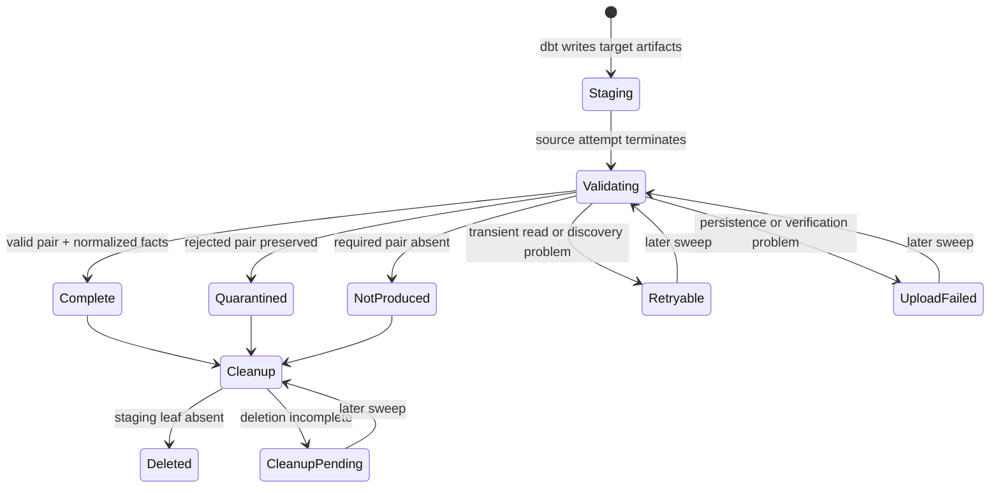

# The evidence lifecycle

The observability path converts producer-controlled dbt output into durable,
content-addressed evidence and sanitized facts. Capture and staging cleanup are
separate state machines so cleanup failure cannot erase or downgrade preserved
evidence.

## From source attempt to canonical archive



The collector reads exactly two files from dbt's target directory:

```text
target/manifest.json
target/run_results.json
```

Other target files and logs are not added to the canonical archive.

## The full attempt key

Every staging leaf, registry row, fact, and archive carries:

```text
workspace_id
job_id
job_run_id
repair_count
task_run_id
execution_count
```

This is the repository's audit, storage, and idempotency key. It preserves the
parent run, repair, retry, and execution context even though Databricks also
assigns unique run IDs. The collector derives the workspace ID from the
authenticated API rather than trusting a notebook parameter.

## Validation narrows the input

Before normalization, the collector:

- correlates the staged attempt with Jobs API history;
- rejects symlinks, path escapes, and unexpected file types;
- enforces compressed, expanded, member, file-count, and directory limits;
- requires the supported manifest and run-results schema versions;
- requires matching dbt `invocation_id` values;
- normalizes only supported commands and node statuses; and
- rejects duplicate node results.

Rejected content is represented by an allowlisted code. Raw exception messages
are not copied into operator-facing facts.

## Canonicalization makes later change detectable

The collector writes the two files in a fixed order with normalized archive
metadata and deterministic gzip output. It calculates SHA-256, puts the archive
under a path containing that digest, opens the destination without overwrite,
and verifies the stored bytes.

That makes identical input produce identical evidence and makes unexpected
post-capture change detectable. It does not prove that the producer told the
truth.

## Capture states describe durable facts

| State | Terminal | Meaning |
|---|---:|---|
| `COMPLETE` | Yes | Archive, invocation, registry, and expected node facts reconcile |
| `QUARANTINED` | Yes | Rejected pair is durably retained with an allowlisted code |
| `NOT_PRODUCED` | Yes | The completed source attempt produced no required pair |
| `RETRYABLE_ERROR` | No | A later sweep should repeat capture |
| `UPLOAD_FAILED` | No | Evidence persistence or verification should be retried |

The first newly discovered `NOT_PRODUCED` attempt fails the collector sweep so
the gap is visible. The durable terminal row prevents the same absence from
poisoning every later sweep.

## Cleanup has its own result

Terminal capture makes a staging leaf eligible for deletion. Cleanup records
`PENDING` or `DELETED` independently of capture state.

A deletion failure leaves durable evidence untouched and keeps cleanup pending
for a later sweep. A retryable capture keeps staging available. There is no
routine policy that deletes `COMPLETE` or `QUARANTINED` canonical evidence.

## The producer trust boundary remains

The source runner controls the JSON before the collector reads it and controls
the repair and execution labels written into its staging path. The collector
correlates the workspace, job, parent run, and task run with Jobs API context,
but it does not independently attest the producer-supplied repair and execution
labels. A compromised source identity can still create misleading yet
structurally valid artifacts.

Separate identities protect evidence from routine post-capture rewriting. They
do not provide malicious-producer attestation. That would require a separate,
independently trusted signing design.

## A managed Volume is not WORM

The evidence Volume is governed and excluded from the runner's privileges, but
a sufficiently privileged administrator or collector can still mutate it.
`prevent_destroy` protects against routine bundle destruction; it is not legal
retention or storage immutability.

If a control requires write-once retention, define and approve that control
outside this demonstration. Unity Catalog
[Volume privileges](https://docs.databricks.com/aws/en/volumes/privileges)
still apply to the mutable managed Volume.

The operational checks are in
[Verify a production deployment](../how-to/verify-production-deployment.md).
