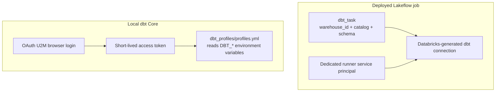

# How dbt connects to Databricks

The project uses `dbt-databricks` to execute SQL through a Databricks SQL
warehouse and create objects in Unity Catalog. Local dbt and the deployed job
reach the same kind of endpoint, but they receive credentials differently.

## The two connection paths

## The deployed job connection

The source job declares its warehouse, catalog, and schema on the `dbt_task`.
Databricks generates the task's dbt connection and injects the workspace host
and access token at run time. The job therefore does not read the repository's
local `profiles.yml`. In production, the bundle assigns a dedicated runner
service principal through the job's `run_as` setting.

The generated credential represents that runner service principal. Successful
authentication does not imply data authorization: the runner still needs
`CAN_USE` on the SQL warehouse and the required Unity Catalog privileges on the
dbt target.

## The local connection

The committed profile contains no credentials or workspace-specific values. It
resolves the host, warehouse HTTP path, catalog, schema, and short-lived access
token from the local process environment.

A person first authenticates the CLI with OAuth U2M, then asks the CLI for a
short-lived access token for the separate dbt Core process. That token belongs
in the current process environment, not in a committed file. It comes from the
interactive U2M session; retrieving it is not a way to reveal an M2M client
secret.

Follow [Run dbt locally](../how-to/run-dbt-locally.md) for the executable steps.
The exact environment variables and profile contract are in
[Configuration values](../reference/configuration-values.md) and
[dbt project](../reference/dbt-project.md).

## Bundle targets and dbt targets are different

A bundle target controls deployment behavior. For example, `dev` selects
development mode and `prod` selects production mode.

A dbt target selects an output from `profiles.yml`. That local target exists
only for local dbt Core.

The deployed `dbt_task` has a Databricks-generated profile with one generated
target, so its command intentionally omits dbt's `--target dev` or
`--target prod`. Passing the local target name to the deployed job would address
a profile entry that does not exist.

## Why the artifact path is not a connection target

The source command also supplies `--target-path`. Despite the similar name, it
only controls where dbt writes artifacts. In this project it points to a
full-attempt directory in the staging Volume, scoped by the complete six-field
AttemptKey.

The collector reads completed `manifest.json` and `run_results.json` from that
location after the source attempt terminates. It uses its own service principal,
not the source task's token.

The canonical staging-path grammar is in
[Evidence layout](../reference/evidence-layout.md).

This separation gives each identity only the connection it needs:

- local developer: U2M token and development data access;
- source runner: warehouse plus dbt target and staging access; and
- collector: Jobs API, staging, evidence, and observability-table access.

See [The authentication model](authentication.md) for the OAuth flows and
[The evidence lifecycle](evidence-lifecycle.md) for what happens after dbt
finishes.
