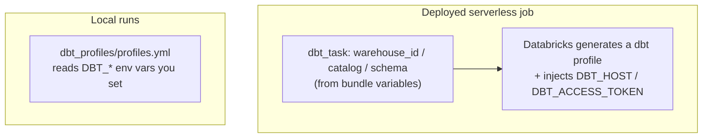

# How dbt connects to Databricks

This project uses the **`dbt-databricks`** adapter — the official,
Databricks-maintained dbt adapter. It connects to a **SQL warehouse** over its
HTTP path and builds objects in **Unity Catalog** (`catalog.schema.object`).

The important idea: the **deployed job** and **local runs** connect *differently*
— one path is generated by Databricks, the other reads env vars you set.

## Two connection paths



### Deployed job

The dbt task in `resources/nyc_taxi.job.yml` names the SQL warehouse, catalog,
and schema directly (from bundle variables). From those task fields, Databricks
**generates** the dbt profile and injects `DBT_HOST` / `DBT_ACCESS_TOKEN` at run
time. There is no `profiles.yml` involved; Databricks manages the credential for
the run.

### Local runs

`dbt_profiles/profiles.yml` is used only on your machine. Every workspace-specific
value is read from an environment variable:

```yaml title="dbt_profiles/profiles.yml"
bricks_cli_dbt:
  target: dev
  outputs:
    dev:
      type: databricks
      method: http
      catalog:   "{{ env_var('DBT_CATALOG') }}"
      schema:    "{{ env_var('DBT_SCHEMA', 'dbt_nyc_taxi') }}"
      http_path: "{{ env_var('DBT_HTTP_PATH') }}"
      threads: 4
      host:  "{{ env_var('DBT_HOST') }}"
      token: "{{ env_var('DBT_ACCESS_TOKEN') }}"
```

Because every value is read from an env var at run time, `profiles.yml` carries
`env_var(...)` calls rather than literal host, warehouse, catalog, or token
values. The how-to has the commands:
[Run dbt locally](../how-to/run-dbt-locally.md).

## Why the job's commands omit `--target`

This trips people up, so it's worth stating plainly.

When `warehouse_id` / `catalog` / `schema` are set on the `dbt_task`, Databricks
generates a profile whose name matches `dbt_project.yml`'s `profile:`
(`bricks_cli_dbt`) but with a **single target** (named `databricks_cluster`). So:

- The job runs one selected `dbt build` invocation with no dbt `--target`.
- Passing `--target dev` would fail with *"profile does not have a target named
  'dev'"* — that target only exists in your **local** `profiles.yml`.

!!! info "Bundle target ≠ dbt target"
    `--target dev` / `--target prod` selects the **bundle target** (its mode, root
    path, and permissions; the workspace host comes from `DATABRICKS_HOST` or your
    profile). The dbt task always runs against the warehouse/catalog/schema you
    supplied as bundle variables. They're two different "targets" that happen to
    share a name.

This is also why the official `dbt-sql` bundle template hardcodes `http_path` in
its `profiles.yml`: Databricks injects `DBT_HOST` / `DBT_ACCESS_TOKEN` but not
`DBT_HTTP_PATH`.

## The adapter and materializations

`requirements-dev.txt` pins the adapter for local dev, and the deployed job
installs the same exact versions into its serverless environments:

```text
dbt-core==1.11.11
dbt-databricks==1.12.2
databricks-sdk==0.117.0
```

`dbt-databricks` supports materializations including `view`, `table`,
`incremental`, `materialized_view`, `streaming_table`, and `ephemeral`. This demo
uses a plain `table` — see [Add a dbt model](../how-to/add-a-model.md) to try the
others.

## Artifact staging stays inside Databricks

The deployed dbt command adds `--target-path` pointing to a per-attempt leaf in
a managed Unity Catalog staging Volume. This controls only where dbt writes
`manifest.json`, `run_results.json`, and other target output; it is unrelated to
the connection selector `--target` discussed above.

After a source run finishes, the separately scheduled collector uses its own
runtime identity to list completed runs, reconcile their staging leaves, and
read exactly the completed manifest and run-results files through governed
POSIX-style `/Volumes/...` paths. It writes a deterministic two-file archive to
a separate evidence Volume and normalizes only allowlisted facts into Delta
tables and curated views. It does not use the local dbt profile, a PAT, an
external telemetry endpoint, or a cloud-specific storage API. Operational
details are in [Observe dbt jobs](../how-to/observe-dbt-jobs.md).
