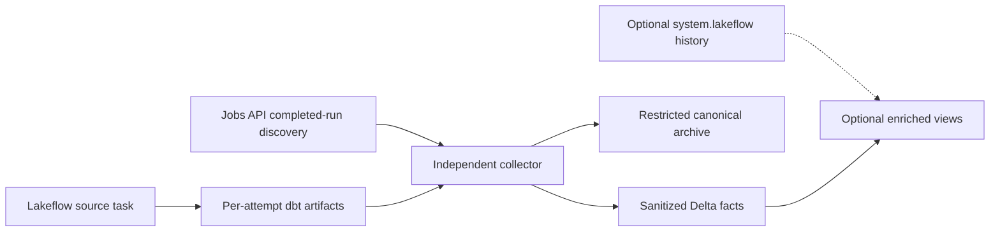

# Why observability stays inside Databricks

The repository combines three native signals instead of sending dbt telemetry
to another platform:

1. Lakeflow Jobs provides immediate source and collector run state.
2. dbt artifacts provide invocation and node meaning.
3. Unity Catalog stores governed operational facts and canonical evidence.

Each signal answers a different question.

## Job state and dbt state are different layers

A Lakeflow task can report that the process succeeded or failed. It does not
describe every model, seed, or test inside one dbt invocation.

`run_results.json` contains the executed dbt nodes, their statuses, timings, and
adapter responses. `manifest.json` supplies the project graph and node metadata.
The collector joins those semantics to the exact Lakeflow attempt identity.

## The source and collector fail independently

The source job owns the result of the dbt build. The collector runs separately
every 15 minutes and owns capture, validation, archival, and staging cleanup.

A collector failure never changes an already terminal source result. Conversely,
a successful collector does not turn a failed dbt build into a successful one.
This separation preserves the meaning of both signals:

- source failure means dbt needs attention;
- collector failure means evidence capture or cleanup needs attention; and
- source or collector cancellation is material because work may be incomplete.

The collector has no in-run retry. A later scheduled sweep reconciles transient
failures, while the first failure remains visible to native notifications.

## Discovery is API-based

The collector uses the Jobs API to enumerate completed source attempts and
correlate them with staged artifacts. It does not depend on system tables for
capture.

The 59-day lookback sits just inside the approximately 60-day run-history window
available through the Jobs interface. It gives the collector room to reconcile
ordinary outages, but it is not indefinite recovery. An outage longer than the
lookback can require an explicitly reviewed backfill strategy.

## Two views are guaranteed

Successful collection creates or refreshes:

- `dbt_run_health` for sanitized attempt and invocation health; and
- `dbt_node_health` for node facts from internally complete attempts.

The node view excludes partial facts. A `COMPLETE` registry row, non-null
archive hash, invocation row, and exact expected node count must reconcile
before nodes appear.

## Three views are best-effort

When the collector can read `system.lakeflow.job_run_timeline` and
`system.lakeflow.job_task_run_timeline`, it also refreshes:

- `lakeflow_job_run_health`;
- `lakeflow_dbt_task_run_health`; and
- `dbt_job_health`.

Those views add the native run timeline and make a terminal run with missing dbt
evidence visible. System tables can lag and require broader privileges, so the
collector treats them as optional. An unavailable refresh emits
`SYSTEM_LAKEFLOW_VIEW_UNAVAILABLE` without failing artifact capture.

Databricks documents 365-day retention for the Lakeflow Jobs system tables.
That longer analytical history does not extend the collector's 59-day API
discovery window. See
[Jobs system tables](https://docs.databricks.com/aws/en/admin/system-tables/jobs).

## Notifications are deliberately narrow

Both jobs define native failure and duration-warning notifications. The source
task alerts only on its final retry attempt. The collector has no retry, so one
failed sweep remains visible.

`notification_emails` defaults to an empty array. This avoids accidental
outbound delivery in a restricted environment; notification recipients must be
approved and configured deliberately. See
[Lakeflow job notifications](https://docs.databricks.com/aws/en/jobs/notifications).

## Why query history is not part of the baseline

`system.query.history` can help a privileged administrator troubleshoot SQL
warehouse statements, but it is not used by this collector. It is a
Public Preview, account-wide operational surface that can expose statement text
and errors. Granting access merely to populate dbt health views would broaden
the design without improving the artifact contract.

The baseline therefore stays with Jobs API metadata plus allowlisted dbt facts.
See [Query history system table](https://docs.databricks.com/aws/en/admin/system-tables/query-history).

The operational procedure is in
[Observability operations](../how-to/observe-dbt-jobs.md); the preservation model is in
[The evidence lifecycle](evidence-lifecycle.md).
