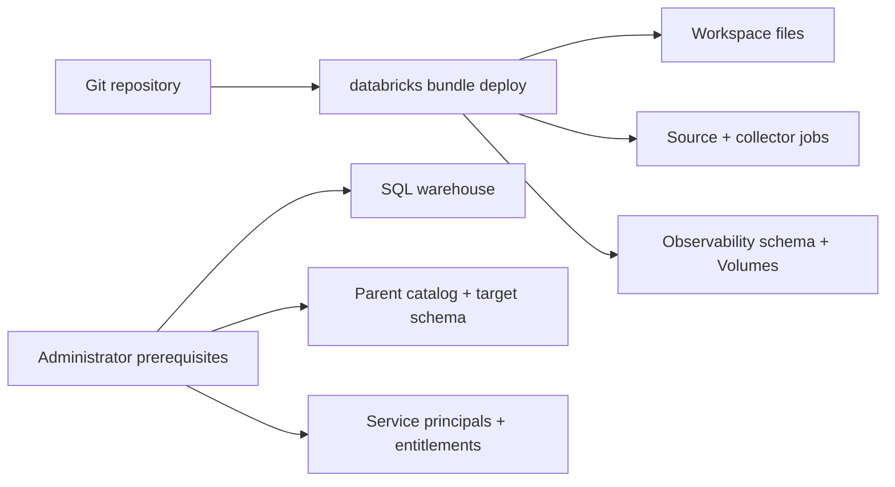
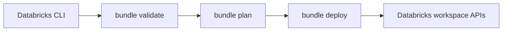

# Why Declarative Automation Bundles

A Declarative Automation Bundle packages source code and Databricks workspace
resources as one versioned deployment unit. It gives this repository a
reviewable description of both dbt execution and the observability controls
around it.

Databricks previously called the feature **Databricks Asset Bundles**. The CLI
and current documentation use **Declarative Automation Bundles**.

## The boundary of a bundle

A bundle deploys workspace resources such as jobs, schemas, Volumes, files, and
their declared permissions. It does not create the Databricks account,
workspace, networking, SQL warehouse, or parent Unity Catalog catalog.

That boundary explains why some production access is declared in
`databricks.yml` while other access belongs in an administrator runbook.

## Why the repository uses a bundle

The configuration keeps several relationships together:

- the source job writes dbt artifacts to the staging Volume;
- the collector can view the source job and reconcile that staging;
- the source and collector use different `run_as` identities;
- the runner cannot access the evidence Volume;
- production schedules and lifecycle protections differ from development; and
- bundle variables carry workspace-specific identifiers without committing
  their values.

Reviewing those relationships in one change is safer than maintaining unrelated
deployment scripts for each resource.

## Direct deployment

Current Databricks CLI bundle commands use the direct deployment engine. The CLI
calls Databricks APIs without requiring a user-managed Terraform binary,
provider, or Terraform state file.

Terraform can still be appropriate for account- or cloud-level infrastructure.
It is simply outside this repository's workspace deployment boundary.

## What deployment modes do

Development mode creates user-scoped resource names and pauses schedules.
Production mode uses stable resource names, a stable workspace root, explicit
`run_as` identities, unpaused collection, and `prevent_destroy` on evidence
resources.

Modes do not automatically isolate data. Both targets write to the catalog,
schema, and warehouse supplied through bundle variables. Separate development
and production values are therefore required.

See [Development and production are different controls](development-vs-production.md)
for the reasoning behind those boundaries.

## Why deployment includes an ACL reconciliation step

The production bundle root is writable only by the deployer. The job identities
must still be able to use the files deployed there. After `bundle deploy`, the
workflow resolves the deployed files directory and applies:

- `CAN_READ` to the source runner; and
- `CAN_RUN` to the collector.

This is deliberately narrower than making the runtime identities editors or
managers. It also means `bundle deploy` alone is not the complete production
operation; the protected workflow owns the post-deploy reconciliation.

## What bundles do not prove

A successful bundle deployment proves that the declared workspace resources
were accepted. It does not prove:

- that the warehouse and external catalog grants are correct;
- that a job run succeeded;
- that optional system tables are available;
- that evidence meets a regulatory retention standard; or
- that a Free Edition workspace is production-ready.

Those assertions require separate verification. The repository treats its AWS
Free Edition deployment as non-commercial functional validation, consistent
with the official
[Free Edition limitations](https://docs.databricks.com/aws/en/getting-started/free-edition-limitations).

Read the official
[Declarative Automation Bundles documentation](https://docs.databricks.com/aws/en/dev-tools/bundles/)
for the product boundary and
[Deploy to production](../how-to/deploy-to-production.md) for this repository's
controlled path.
