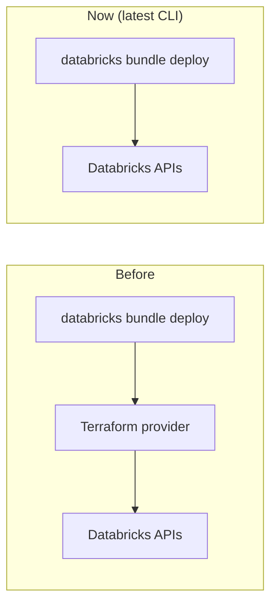

# Why Declarative Automation Bundles

> **Is a bundle still the way to go?** Yes. This page is the long answer.

## What a bundle is

A **Declarative Automation Bundle** — the feature historically called *Databricks
Asset Bundles* — expresses a "data/AI/analytics project as code": your source
plus the Databricks resources that run it (jobs, pipelines, …), described in YAML
and deployed with `databricks bundle`. It is the **first-party, recommended** unit
of deployment for Databricks and is built into the CLI — nothing extra to install.

## Direct deployment: no Terraform required

Historically, a bundle deploy delegated to an embedded Terraform provider. The
latest CLI ships a **direct deployment** engine that calls the Databricks APIs
itself, removing the Terraform dependency. That is exactly the promise in this
repo's name: *"the new Databricks CLI that does not need Terraform."*

Practical effects:

- No Terraform binary, provider download, or `.tf` state to manage.
- `databricks bundle deploy` / `plan` / `destroy` operate directly on the APIs.
- Infrastructure that genuinely needs Terraform (VNets, the workspaces
  themselves) is still Terraform's job — bundles deploy **code and workspace
  resources**, not the cloud account underneath.

## Why bundles over rolling your own

| Concern | Bundles give you |
|---------|------------------|
| Reproducibility | One declarative source of truth, versioned in Git |
| Environments | `targets` (dev/prod) with per-target overrides |
| Safety | `development` mode isolates and prefixes resources, pauses schedules |
| CI/CD | `validate` → `deploy` → `run` map cleanly onto pipeline stages |
| Drift / cleanup | `summary`, `plan`, and `destroy` |

## Deployment modes (why `dev` is safe)

`mode: development` (the default `dev` target):

- prefixes deployed resources with `[dev <your-username>]`,
- **pauses** schedules/triggers so nothing fires while you iterate,
- marks resources as development copies so they're easy to find and clean up.

`mode: production` (the `prod` target) deploys "for real" to a fixed `root_path`
under the deploying principal's home directory (the service principal's in CI) and
applies the permissions you declare.

This is why the [tutorial](../tutorials/deploy-and-run.md) deploys to `dev` first:
you can experiment with the *job* without disturbing the prod deployment. Dev mode
isolates the job resource, not the data — the dbt task writes to whatever
catalog/schema you supply, so use separate schemas to keep dev and prod tables
apart.

## How it maps to this repo

`databricks.yml` is the root; the one resource (`resources/nyc_taxi.job.yml`) is a
serverless job that runs dbt. The field-by-field details are in
[Bundle configuration](../reference/bundle-config.md) and
[The dbt job resource](../reference/job-resource.md).

## Sources

- Databricks CLI bundle help (`databricks bundle --help`) — *"Declarative
  Automation Bundles let you express data/AI/analytics projects as code."*
- Microsoft Learn:
  [Databricks Asset Bundles](https://learn.microsoft.com/azure/databricks/dev-tools/bundles/)
  and the
  [release notes](https://learn.microsoft.com/azure/databricks/release-notes/dev-tools/bundles)
  (direct deployment, GA).
- The CLI's own `dbt-sql` bundle template, which this project is modelled on.
