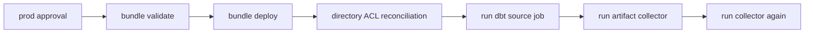

# Deploy to production

Deploy the reviewed `main` branch through the protected GitHub `prod`
environment, then run the source and two-sweep collector acceptance check.

In this repository, “production” names the stable bundle target and its
identity controls. The current AWS Free Edition workspace remains a
non-commercial functional-validation environment, not regulated production.

## Prerequisites

Before merging:

- complete [OAuth M2M CI/CD setup](set-up-m2m-cicd.md);
- protect the `prod` environment with required review and a `main` branch rule;
- configure all required repository variables and the environment secret;
- grant the deployer authority to assign both `run_as` identities;
- grant the runner's warehouse and dbt-target prerequisites;
- grant the collector's workspace and parent-catalog prerequisites; and
- ensure pull-request CI passes.

Pull-request CI is intentionally credential-free. It runs linting, formatting,
type checks, tests, and offline dbt parsing without exposing a reusable
Databricks credential to pull-request code. Workspace-aware bundle validation
runs only after protected production approval.

## 1. Review the production change

Confirm that the change does not:

- point `prod` at a development dbt schema;
- grant the runner access to the evidence Volume;
- merge deployer, runner, and collector identities;
- remove `prevent_destroy` from production evidence resources;
- add unapproved notification recipients; or
- make optional system-table access a prerequisite for artifact capture.

Merge the reviewed pull request to `main`.

## 2. Approve the protected deployment

The merge triggers `.github/workflows/deploy.yml`. GitHub pauses the job at the
`prod` environment before releasing `DATABRICKS_CLIENT_SECRET`.

Review the commit and deployment target, then approve the environment. For an
intentional rerun of the current `main`:

```bash
gh workflow run deploy.yml --ref main -f operation=deploy
```

Do not run production deployment from an unreviewed branch.

## 3. Follow the workflow stages

The workflow performs these stages in order:



The directory ACL stage is required. It resolves
`workspace.file_path` from bundle state, then grants runner `CAN_READ` and
collector `CAN_RUN` without giving either identity edit or management rights.

The second collector sweep is the idempotency acceptance check. The workflow
stops if validation, deployment, ACL reconciliation, the source run, or either
collector run fails.

## 4. Record the deployment result

After the workflow succeeds, select its exact reviewed commit and inspect the
run:

```bash
export APPROVED_SHA="<full-reviewed-main-commit-sha>"
gh run list \
  --workflow deploy.yml \
  --commit "$APPROVED_SHA" \
  --json databaseId,headSha,status,conclusion,url

export DEPLOY_RUN_ID="<approved-workflow-run-id-from-the-list>"
gh run view "$DEPLOY_RUN_ID" \
  --json headSha,status,conclusion,url,jobs
gh run view "$DEPLOY_RUN_ID" --log | grep 'ACCEPTANCE_RUN_IDS'
```

Confirm:

- `headSha` is the reviewed commit you intended to deploy;
- workflow conclusion is `success`;
- validation, deployment, ACL, source, and both collector stages passed; and
- one `ACCEPTANCE_RUN_IDS` line records the source parent/task IDs and both
  collector parent IDs.

Keep the workflow URL and four Databricks run IDs for the verification task.

## 5. Verify evidence

Complete
[Verify a production deployment](verify-production-deployment.md). A green
workflow is necessary but not sufficient: the verification checks durable
registry state, the two guaranteed views, least privilege, and collector
idempotency.

## Success criteria

Deployment succeeds when:

- the workflow used the protected `prod` environment;
- OAuth M2M authenticated the deployer service principal;
- the bundle deployed from reviewed `main`;
- runtime directory ACLs were reconciled;
- source and both collector sweep stages reported terminal success; and
- the exact four workflow-created run IDs were recorded for independent
  verification.

## Recovery

If validation fails, correct the bundle or required variables in a new pull
request. Do not bypass validation.

If deployment succeeds but ACL reconciliation fails, do not repeatedly run the
jobs as the deployer. Follow
[Repair production runtime file access](grant-production-runtime-access.md),
then rerun the protected workflow.

If the source fails, preserve its result and investigate dbt, warehouse, or
target-schema access. Run the collector separately only after understanding
whether artifacts were produced.

If the collector fails, do not change the source result or delete staging.
Follow [Observability operations](observe-dbt-jobs.md); a later sweep can reconcile
retryable capture or cleanup.

If M2M authentication fails, use
[Rotate the deployer secret](rotate-the-deployer-secret.md). Do not replace it
with a PAT.

Production evidence resources declare `prevent_destroy`. Retirement requires a
separate retention, export, ownership, access-revocation, and deletion decision;
development cleanup steps do not apply.
