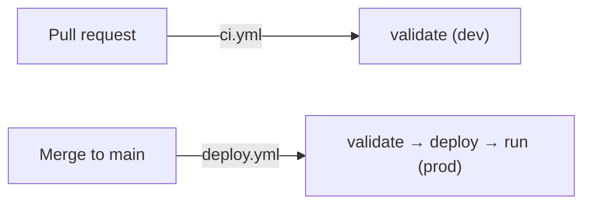

# Deploy to production

The `prod` target deploys the bundle "for real" — to a fixed workspace path under
the **deploying principal's** home directory (in CI, that's the service
principal), with the permissions you declare, and without development-mode
prefixing or paused schedules.

## From the CLI

Export your **production** `BUNDLE_VAR_*` values (the same variables as in
[the tutorial](../tutorials/deploy-and-run.md)), then swap the target to `prod`.
Because bundle targets don't isolate data, point prod at its own catalog/schema —
for example `export BUNDLE_VAR_schema="<prod-schema>"` — rather than reusing the
`dev` schema:

```bash
databricks bundle validate -t prod -p bricks-demo
databricks bundle deploy   -t prod -p bricks-demo
databricks bundle run nyc_taxi_dbt_job -t prod -p bricks-demo
```

!!! warning "`prod` is not development mode"
    Unlike `dev`, the `prod` target does **not** prefix resources with
    `[dev <you>]` or pause schedules. Deploys land at a fixed `root_path` under
    whoever runs the deploy — your home directory locally, or the service
    principal's in CI — and apply the declared permissions. Double-check the
    target before you deploy.

## From CI (recommended)

Once [OIDC CI/CD is set up](set-up-oidc-cicd.md), production deploys happen
automatically:

- **Merge to `main`** → `deploy.yml` runs `validate` → `deploy` → `run` against
  `prod`.
- Or trigger it manually with **workflow_dispatch** from the Actions tab.



!!! tip "Gate it with an approval"
    Add **required reviewers** to the `prod` GitHub Environment so a human must
    approve before the production deploy proceeds.

## Inspect and clean up

```bash
databricks bundle summary -t prod -p bricks-demo   # what's deployed?
databricks bundle destroy -t prod -p bricks-demo   # tear it down
```

## Related

- [Set up secretless CI/CD with OIDC](set-up-oidc-cicd.md)
- Reference: [Bundle configuration](../reference/bundle-config.md) ·
  [CLI commands](../reference/cli-commands.md)
- Explanation: [Why Declarative Automation Bundles](../explanation/why-asset-bundles.md)
