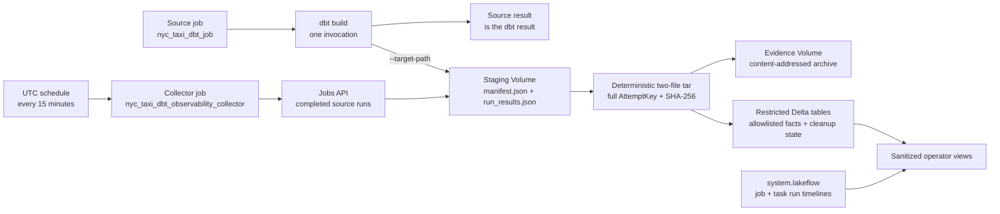

# Observe dbt jobs without leaving Databricks

This runbook deploys, verifies, and operates the repository's Databricks-native
dbt observability path. It uses dbt Core, Lakeflow Jobs, Unity Catalog managed
Volumes, Delta tables, and Databricks system tables. It requires no external
telemetry platform, cloud-specific monitoring service, or external artifact
store.

It answers two independent questions:

- **Did the source dbt job run successfully and on time?**
- **Did the collector durably capture and then clean up the staged artifacts for
  every completed dbt attempt?**

## Understand the two-job design



The source task runs one selected dbt invocation. Its command includes a unique
staging leaf as dbt's `--target-path`:

```text
dbt --log-format-file json build \
  --target-path /Volumes/<catalog>/<observability-schema>/dbt_artifacts_staging/
    workspace_id=<workspace>/job_id=<job>/job_run_id=<run>/
    repair_count=<repair>/task_run_id=<task-run>/
    execution_count=<execution>/target \
  --select +nyc_taxi_trips ...
```

dbt writes `manifest.json` and `run_results.json` beneath that `target/`
directory. This is dbt's supported artifact-location control; see
[`target-path`](https://docs.getdbt.com/reference/global-configs/json-artifacts).
The source job contains no collector task, so its terminal result remains the
dbt result.

The collector is a separate Lakeflow job named
`nyc_taxi_dbt_observability_collector`. Every 15 minutes in production it:

1. lists completed runs of `nyc_taxi_dbt_job` through the Jobs API;
2. reconciles the matching staging leaves for `dbt_nyc_taxi` attempts;
3. reads exactly `target/manifest.json` and `target/run_results.json`;
4. builds a deterministic tar containing only those two files;
5. validates and writes that archive to the evidence Volume by content hash;
6. merges allowlisted invocation and node facts; and
7. deletes the staging leaf only after durable terminal capture is reconciled.

The post-run boundary prevents the collector from reading JSON files while dbt
is still writing them. It also preserves separate operational signals:

- a **source job failure** means dbt failed;
- a **source or collector cancellation** is material because it can interrupt
  artifact production or reconciliation;
- a **collector job failure** means capture, reconciliation, or staging cleanup
  needs attention; and
- collector status never changes the already-terminal source result.

Development mode pauses both job schedules. Run the source and collector
manually while validating `dev`.

## Use the full attempt identity

One task run ID is not enough to distinguish repairs and executions. Every
staging path, registry row, normalized fact, and archive path uses the complete
attempt identity:

```text
AttemptKey = (
  workspace_id,
  job_id,
  job_run_id,
  repair_count,
  task_run_id,
  execution_count
)
```

The collector derives `workspace_id` from the authenticated Databricks API; it
is not an overrideable notebook parameter. The other run fields come from the
source run plus the staging path created by Lakeflow dynamic value references.
Retries, repairs, and returned task executions therefore remain separate even
when they belong to the same logical job run.

Each sweep looks back 59 days and processes at most 100 incomplete attempts.
Never-seen attempts are handled before retries; retryable gaps are ordered by
their last attempt time. The collector continues through the selected batch and
fails once at the end if any attempt failed or work was deferred, so the native
collector alert represents the whole sweep.

## Know where evidence is stored

The bundle creates two managed Volumes in the target-scoped observability
schema:

| Object | Default name | Purpose |
|--------|--------------|---------|
| staging Volume | `dbt_artifacts_staging` | Short-lived per-attempt dbt target directories |
| evidence Volume | `dbt_artifacts` | Restricted canonical archives under `raw/` or `quarantine/` |

Development mode adds a user-specific prefix to the observability schema. Read
the exact schema name from `databricks bundle plan -o json` or
`databricks bundle summary`; production uses
`<catalog>.dbt_observability_prod` by default.

The collector creates three restricted Delta tables:

| Table | Purpose |
|-------|---------|
| `dbt_artifact_registry` | Full AttemptKey, capture state, cleanup state, hashes, path, and versions |
| `dbt_invocations` | Sanitized invocation counts and timings |
| `dbt_node_results` | Sanitized seed/model/test status and timings |

It exposes five curated views for routine operators:

| View | Purpose |
|------|---------|
| `dbt_run_health` | Sanitized capture and invocation health |
| `dbt_node_health` | Allowlisted node status and timing from internally complete `COMPLETE` attempts only |
| `lakeflow_job_run_health` | Source Lakeflow run timeline |
| `lakeflow_dbt_task_run_health` | Configured dbt task timeline |
| `dbt_job_health` | Native source runs left-joined to task and dbt evidence, including missing evidence |

## Understand capture and cleanup state

Capture and staging deletion are separate state machines.

| `capture_status` | Terminal? | Meaning |
|------------------|-----------|---------|
| `COMPLETE` | yes | Canonical archive, registry, invocation facts, and all expected node facts reconcile |
| `QUARANTINED` | yes | Canonical archive was durably stored under `quarantine/`, but allowlisted validation rejected it |
| `NOT_PRODUCED` | yes | The completed attempt was reconciled and did not produce the required artifact pair |
| `RETRYABLE_ERROR` | no | Staging read, validation preparation, or another transient capture step should be retried |
| `UPLOAD_FAILED` | no | Evidence persistence or remote integrity verification should be retried |

The registry also records:

- `staging_cleanup_status`: `PENDING` or `DELETED`;
- `staging_cleanup_error_code`: allowlisted cleanup failure, otherwise null;
- `staging_cleanup_updated_at`: last cleanup transition time; and
- `staging_deleted_at`: successful deletion time, otherwise null.

`COMPLETE` and `QUARANTINED` are terminal only when their durable evidence is
internally consistent. A later sweep reconciles terminal rows with staging: a
leftover leaf remains `PENDING`, deletion is retried without duplicating the
archive or facts, and the collector alerts until it becomes `DELETED`.
`NOT_PRODUCED` is terminal after absence is confirmed and likewise reconciles
the empty or residual staging state. Retryable capture rows keep their staging
files.

Staging cleanup never deletes the content-addressed evidence archive. There is
no default policy that deletes `COMPLETE` or `QUARANTINED` evidence.

## Check the production access boundary

Production uses three distinct service principals:

| Identity | Access |
|----------|--------|
| deployer | Manage bundle resources and their grants |
| source dbt runner | SQL warehouse and target dbt catalog/schema; `USE CATALOG`, `USE SCHEMA`, and **`READ VOLUME` plus `WRITE VOLUME` only** on staging |
| collector | `CAN_VIEW` on the source job; `READ VOLUME` and `WRITE VOLUME` on staging and evidence; create/read/modify on restricted observability tables |

Unity Catalog grants Volume privileges at the Volume boundary, not per attempt
directory. The source identity can therefore read and write the staging Volume;
the job convention confines normal writes to its short-lived AttemptKey leaf
because dbt may re-read target state during the invocation. It cannot access the
evidence Volume or base evidence tables, so it cannot rewrite the record
produced by the collector. The collector needs write access to staging to remove
reconciled leaves.

### Preserve the producer trust boundary

Staging content is a producer assertion until the collector captures it. The
collector correlates workspace, job, parent run, and task run IDs with the Jobs
API; rejects symlinks, unexpected file types, and path escapes; validates the
two JSON artifacts; and hashes the canonical archive. The source identity still
controls the pre-capture JSON content plus the `repair_count` and
`execution_count` staging labels. Separate identities prevent the source from
rewriting evidence **after** capture; they do not make a compromised source
cryptographically trustworthy before capture.

Protect source code review, deployment rights, and the source service principal
accordingly. If the threat model requires malicious-producer resistance, add an
independently approved signing or attestation control rather than treating the
SHA-256 alone as provenance.

Because the parent catalog is external to the bundle, grant its usage to both
runtime principals as appropriate:

```sql
GRANT USE CATALOG ON CATALOG `<catalog>` TO `<source-dbt-principal>`;
GRANT USE CATALOG ON CATALOG `<catalog>` TO `<collector-principal>`;
```

The optional Lakeflow views require these additional collector grants:

```sql
GRANT USE CATALOG ON CATALOG system TO `<collector-principal>`;
GRANT USE SCHEMA ON SCHEMA system.lakeflow TO `<collector-principal>`;
GRANT SELECT ON TABLE system.lakeflow.job_run_timeline
  TO `<collector-principal>`;
GRANT SELECT ON TABLE system.lakeflow.job_task_run_timeline
  TO `<collector-principal>`;
```

Artifact capture does not depend on the optional system-table join.

## Treat Volume storage honestly

The evidence path is content-addressed, writes do not overwrite an existing
archive, and the collector verifies SHA-256 against the registry. These are
application-level tamper-evident controls. A managed Unity Catalog Volume is
still mutable for sufficiently privileged identities and is **not WORM
storage**. If regulation requires write-once retention, add a separately
approved retention/export control.

The collector uses governed POSIX-style `/Volumes/...` paths. Databricks Volumes
do not support direct append or non-sequential random writes, so this design does
neither: dbt finishes each JSON artifact before collection, the collector reads
the files sequentially, constructs the canonical archive as a complete object,
and writes completed evidence sequentially. See
[Work with files in Unity Catalog Volumes](https://docs.databricks.com/en/volumes/volume-files.html#limitations-of-working-with-files-in-volumes).

The collector has no Azure-native storage or telemetry dependency.

## Configure one target

```bash
export BUNDLE_VAR_warehouse_id="<your-warehouse-id>"
export BUNDLE_VAR_catalog="<your-catalog>"
export BUNDLE_VAR_schema="dbt_nyc_taxi_dev"
export BUNDLE_VAR_observability_schema="dbt_observability"
export BUNDLE_VAR_observability_staging_volume="dbt_artifacts_staging"
export BUNDLE_VAR_observability_volume="dbt_artifacts"
export BUNDLE_VAR_job_duration_warning_seconds="900"
```

`notification_emails` is a complex variable. Put it in the target's ignored
override file:

```json title=".databricks/bundle/dev/variable-overrides.json"
{
  "notification_emails": []
}
```

Leave the list empty when outbound email is prohibited. If internal email is an
approved control, use an approved distribution list rather than a personal
address.

Bundle variables resolve at deployment time. Use the same values for
`validate`, `plan`, `deploy`, `run`, and `destroy`; changing them only on `run`
does not reconfigure the jobs.

!!! warning "Dev job isolation is not data isolation"
    Development mode prefixes both jobs and observability objects, but dbt still
    writes models to `BUNDLE_VAR_schema`. Use a dedicated validation schema.

## Validate and deploy

```bash
export DATABRICKS_PROFILE="<your-profile>"

databricks bundle validate -t dev -p "$DATABRICKS_PROFILE" -o json \
  > /tmp/bricks-cli-bundle.json

if grep -q 'REPLACE_WITH_YOUR_' /tmp/bricks-cli-bundle.json; then
  echo "A required bundle variable is still a placeholder" >&2
  exit 1
fi

databricks bundle plan    -t dev -p "$DATABRICKS_PROFILE"
databricks bundle deploy  -t dev -p "$DATABRICKS_PROFILE"
databricks bundle summary -t dev -p "$DATABRICKS_PROFILE"
```

Confirm the summary contains:

- `nyc_taxi_dbt_job`;
- `dbt_observability_collector_job`;
- the target-scoped observability schema;
- staging Volume `dbt_artifacts_staging`; and
- evidence Volume `dbt_artifacts`.

## Verify a successful source run and capture

Run the source job and wait for its terminal result:

```bash
databricks bundle run nyc_taxi_dbt_job \
  -t dev -p "$DATABRICKS_PROFILE"
```

The source job should contain one successful `dbt_nyc_taxi` task. Before
running the paused development collector, an authorized evidence reviewer can
confirm the attempt leaf contains both required files:

```text
/Volumes/<catalog>/<observability-schema>/dbt_artifacts_staging/
  workspace_id=<workspace>/job_id=<job>/job_run_id=<run>/
  repair_count=<repair>/task_run_id=<task-run>/
  execution_count=<execution>/target/manifest.json

/Volumes/<catalog>/<observability-schema>/dbt_artifacts_staging/
  workspace_id=<workspace>/job_id=<job>/job_run_id=<run>/
  repair_count=<repair>/task_run_id=<task-run>/
  execution_count=<execution>/target/run_results.json
```

Do not grant routine operators staging access merely for this check. Use a
temporary validation principal or an approved evidence reviewer.

Run the collector manually in `dev`:

```bash
databricks bundle run dbt_observability_collector_job \
  -t dev -p "$DATABRICKS_PROFILE"
```

The first sweep should capture the attempt and delete its staging leaf. Run the
collector again. The second sweep must not add registry, invocation, node, or
archive records; it only reconciles any remaining `PENDING` cleanup.

The serverless runtimes are pinned to `dbt-core==1.11.11`,
`dbt-databricks==1.12.2`, and `databricks-sdk==0.117.0`.
`dbt_project.yml` disables dbt anonymous usage statistics.

## Verify the registry and archive

Use a restricted evidence-review identity for the base registry query:

```sql
SELECT
  workspace_id,
  job_id,
  job_run_id,
  repair_count,
  task_run_id,
  execution_count,
  capture_status,
  capture_error_code,
  staging_cleanup_status,
  staging_cleanup_error_code,
  staging_cleanup_updated_at,
  staging_deleted_at,
  archive_sha256,
  archive_path,
  file_count,
  captured_at
FROM `<catalog>`.`<observability-schema>`.`dbt_artifact_registry`
ORDER BY job_run_id DESC, repair_count DESC,
         task_run_id DESC, execution_count DESC;
```

For a normal completed attempt, expect:

- exactly one row for the full AttemptKey;
- `capture_status = 'COMPLETE'`;
- `file_count = 2`;
- a non-null `archive_sha256` and `archive_path`;
- `staging_cleanup_status = 'DELETED'`;
- null `staging_cleanup_error_code`; and
- non-null `staging_deleted_at`.

The canonical archive path includes every attempt dimension:

```text
/Volumes/<catalog>/<observability-schema>/dbt_artifacts/raw/
  workspace_id=<workspace>/job_id=<job>/job_run_id=<run>/
  repair_count=<repair>/task_run_id=<task-run>/
  execution_count=<execution>/sha256=<digest>/dbt-output.tar.gz
```

The tar always contains these members in canonical form:

```text
target/manifest.json
target/run_results.json
```

Member order and metadata are normalized, including timestamps and ownership,
so identical input bytes produce identical archive bytes and SHA-256. Invalid
artifact pairs use the same AttemptKey path below `quarantine/`.

Check for incomplete capture or cleanup:

```sql
SELECT
  capture_status,
  staging_cleanup_status,
  staging_cleanup_error_code,
  count(*) AS attempts
FROM `<catalog>`.`<observability-schema>`.`dbt_artifact_registry`
WHERE capture_status IN ('RETRYABLE_ERROR', 'UPLOAD_FAILED')
   OR staging_cleanup_status = 'PENDING'
GROUP BY capture_status, staging_cleanup_status, staging_cleanup_error_code;
```

Re-run the collector after fixing access or storage errors. Reconciliation must
preserve an existing terminal archive/hash while retrying only the missing
facts or staging deletion.

## Query sanitized health

Routine operators should query views, not the registry or either Volume:

```sql
SELECT
  generated_at,
  job_run_id,
  repair_count,
  task_run_id,
  execution_count,
  upstream_result_state,
  capture_status,
  invocation_status,
  elapsed_seconds,
  total_nodes,
  failed_nodes
FROM `<catalog>`.`<observability-schema>`.`dbt_run_health`
ORDER BY generated_at DESC;
```

```sql
SELECT
  job_run_id,
  repair_count,
  task_run_id,
  execution_count,
  unique_id,
  resource_type,
  node_name,
  status,
  execution_seconds,
  failures,
  rows_affected
FROM `<catalog>`.`<observability-schema>`.`dbt_node_health`
WHERE status NOT IN ('success', 'pass', 'no-op')
   OR execution_seconds >= 30
ORDER BY job_run_id DESC, repair_count DESC,
         task_run_id DESC, execution_count DESC;
```

`lakeflow_job_run_health` is independently scoped to the configured workspace
and source job. `lakeflow_dbt_task_run_health` is additionally scoped to the
configured dbt task key. `dbt_job_health` starts from those native job runs and
left-joins task history by `(workspace_id, job_id, job_run_id)`, then joins dbt
evidence to the exact native `task_run_id`. Full AttemptKey columns remain in
the dbt side of the view so repairs and executions do not collapse or
cross-join:

```sql
SELECT
  started_at,
  ended_at,
  result_state,
  termination_code,
  native_task_run_id,
  task_result_state,
  repair_count,
  task_run_id,
  execution_count,
  capture_status,
  evidence_status,
  invocation_status,
  dbt_elapsed_seconds,
  failed_nodes
FROM `<catalog>`.`<observability-schema>`.`dbt_job_health`
ORDER BY started_at DESC, repair_count DESC, execution_count DESC;
```

A terminal native run remains visible even if no staging leaf or registry row
exists: `evidence_status = 'MISSING'`. A native run without a terminal result is
`PENDING`; when registry evidence exists, `evidence_status` is its capture
status. This makes absence observable instead of letting the registry define
the monitoring population.

Lakeflow system tables are not a real-time alert channel. Use the source job
state for immediate dbt status and allow time for system-table ingestion.

## Grant operators only the curated views

```sql
GRANT USE CATALOG ON CATALOG `<catalog>` TO `<dbt-operators>`;
GRANT USE SCHEMA ON SCHEMA `<catalog>`.`<observability-schema>`
  TO `<dbt-operators>`;

GRANT SELECT ON VIEW `<catalog>`.`<observability-schema>`.`dbt_run_health`
  TO `<dbt-operators>`;
GRANT SELECT ON VIEW `<catalog>`.`<observability-schema>`.`dbt_node_health`
  TO `<dbt-operators>`;
GRANT SELECT ON VIEW `<catalog>`.`<observability-schema>`.`lakeflow_job_run_health`
  TO `<dbt-operators>`;
GRANT SELECT ON VIEW `<catalog>`.`<observability-schema>`.`lakeflow_dbt_task_run_health`
  TO `<dbt-operators>`;
GRANT SELECT ON VIEW `<catalog>`.`<observability-schema>`.`dbt_job_health`
  TO `<dbt-operators>`;
```

Do not grant routine operators `READ VOLUME` on staging or evidence, or direct
`SELECT` on the three base tables. Audit direct and inherited grants:

```sql
SHOW GRANTS ON SCHEMA `<catalog>`.`<observability-schema>`;
SHOW GRANTS ON VOLUME
  `<catalog>`.`<observability-schema>`.`dbt_artifacts_staging`;
SHOW GRANTS ON VOLUME
  `<catalog>`.`<observability-schema>`.`dbt_artifacts`;
SHOW GRANTS ON TABLE
  `<catalog>`.`<observability-schema>`.`dbt_artifact_registry`;
SHOW GRANTS ON VIEW
  `<catalog>`.`<observability-schema>`.`lakeflow_dbt_task_run_health`;
SHOW GRANTS ON VIEW
  `<catalog>`.`<observability-schema>`.`dbt_job_health`;
```

## Verify a failed source attempt

Use only an isolated `dev` deployment. Temporarily change the source command's
selector to a guaranteed-empty selector while preserving the committed
`--target-path`, deploy, run the source job, and then revert the selector. This
tests failure capture without removing the staging contract.

The source result must remain failed. Run the collector separately. Depending
on how early dbt stopped:

- if both JSON artifacts were completed, capture can be `COMPLETE` even though
  the source dbt result is failed;
- if the pair is invalid but durably retained, capture is `QUARANTINED`; or
- if dbt produced no complete pair, capture is `NOT_PRODUCED`.

When the native system-table row has arrived, `dbt_job_health` shows the
terminal run even before evidence exists. It reports
`evidence_status = 'MISSING'` until the collector records a terminal state such as
`NOT_PRODUCED`.

The collector may fail for a retryable capture or cleanup problem, but its
result never changes the source failure.

## Troubleshoot collection signals

| Signal | Meaning | First check |
|--------|---------|-------------|
| Source job `FAILED` | dbt failed | Source task logs and `run_results.json`, when produced |
| Source or collector `CANCELED` | Artifact production or reconciliation may be incomplete | Treat the alert as actionable; inspect staging and rerun as appropriate |
| Collector job `FAILED` | Capture, reconciliation, cleanup, or backlog needs attention | Sweep summary and registry codes |
| `COMPLETE` | Canonical archive and normalized facts reconcile | Full AttemptKey and node count |
| `QUARANTINED` | Artifact pair was preserved but validation rejected it | Allowlisted `capture_error_code` and restricted quarantine path |
| `NOT_PRODUCED` | Completed attempt had no required pair | Source start/termination path and staging leaf |
| `RETRYABLE_ERROR` | Transient staging or capture failure | Staging path, permissions, and sequential file readability |
| `UPLOAD_FAILED` | Evidence write or SHA-256 verification failed | Evidence Volume privileges and existing hash |
| cleanup `PENDING` | Durable terminal capture exists but staging deletion is incomplete | `staging_cleanup_error_code`, then rerun collector |
| cleanup `DELETED` | Staging leaf is absent after reconciliation | No action |
| `evidence_status = 'MISSING'` | Native terminal run has no registry evidence | Jobs API discovery, source instrumentation, and collector lag |
| More than 100 incomplete attempts | One sweep deferred backlog | Let later sweeps drain it and investigate sustained lag |
| Repeated sweep adds duplicate rows | AttemptKey regression | Uniqueness across all six AttemptKey fields |
| dbt view populated but Lakeflow join empty | System-table row has not arrived | Retry later; use Jobs API state meanwhile |

## Clean up an isolated dev validation

!!! danger "Never use these steps for production evidence"
    Production evidence and staging resources have `prevent_destroy`
    protection. Retention and decommissioning require a separate approved
    process.

First run the collector until no retryable capture or pending staging cleanup
remains:

```sql
SELECT count(*) AS unresolved
FROM `<catalog>`.`<observability-schema>`.`dbt_artifact_registry`
WHERE capture_status IN ('RETRYABLE_ERROR', 'UPLOAD_FAILED')
   OR staging_cleanup_status = 'PENDING';
```

For an isolated disposable validation, the result should be zero. Then remove
the collector-created views and tables before destroying the bundle-managed
schema and both Volumes:

```sql
DROP VIEW IF EXISTS `<catalog>`.`<observability-schema>`.`dbt_job_health`;
DROP VIEW IF EXISTS `<catalog>`.`<observability-schema>`.`lakeflow_dbt_task_run_health`;
DROP VIEW IF EXISTS `<catalog>`.`<observability-schema>`.`lakeflow_job_run_health`;
DROP VIEW IF EXISTS `<catalog>`.`<observability-schema>`.`dbt_node_health`;
DROP VIEW IF EXISTS `<catalog>`.`<observability-schema>`.`dbt_run_health`;

DROP TABLE IF EXISTS `<catalog>`.`<observability-schema>`.`dbt_node_results`;
DROP TABLE IF EXISTS `<catalog>`.`<observability-schema>`.`dbt_invocations`;
DROP TABLE IF EXISTS `<catalog>`.`<observability-schema>`.`dbt_artifact_registry`;
```

Confirm the summary names both jobs, the staging Volume, and the evidence
Volume, then destroy `dev`:

```bash
databricks bundle summary -t dev -p "$DATABRICKS_PROFILE"
databricks bundle destroy -t dev -p "$DATABRICKS_PROFILE"
```

Verify both jobs and both Volumes are gone. Finally remove only the dbt-created
relations from the dedicated validation schema:

```sql
DROP TABLE IF EXISTS `<catalog>`.`dbt_nyc_taxi_dev`.`nyc_taxi_trips`;
DROP TABLE IF EXISTS `<catalog>`.`dbt_nyc_taxi_dev`.`nyc_taxi_trips_seed`;
DROP SCHEMA IF EXISTS `<catalog>`.`dbt_nyc_taxi_dev`;
```

Do not use `CASCADE` on a shared schema. Never delete `COMPLETE` or
`QUARANTINED` production evidence as ordinary housekeeping.
