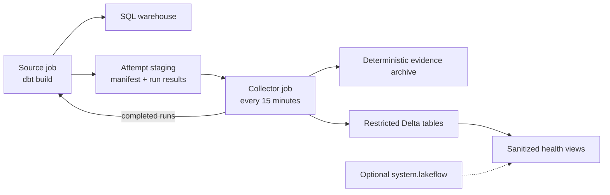

# Databricks-native dbt observability

Deploy dbt Core, preserve per-attempt evidence, and query sanitized health facts
without sending operational telemetry to another platform. This site documents
the complete reference implementation in this repository.

!!! danger "Free Edition is not a regulated production environment"

    The tested workspace is AWS Databricks Free Edition. It is useful for
    functional validation, but it is non-commercial and lacks compliance
    enforcement, security customization, private networking, account-level
    APIs, an SLA, and support. Apply the design only inside your organization's
    approved Databricks account, retention controls, notification channels, and
    operating procedures.

    Use only the included public demonstration data in this personal workspace.
    Never upload Personal Data, confidential, proprietary, or regulated data to
    Free Edition. Databricks documents it for exploratory datasets and reserves
    the right to train on uploaded data.

## The outcome

The source job reports the dbt result. The collector reports capture, validation,
cleanup, and backlog failures independently. Each attempt is keyed by workspace,
job, parent run, repair, task run, and execution, so retries cannot overwrite one
another.

## Choose your path

-   :material-school:{ .lg .middle } **Learn by doing**

    ---

    Authenticate, deploy the development target, run dbt, and observe your first
    governed capture.

    [:octicons-arrow-right-24: Start the tutorial](tutorials/index.md)

-   :material-tools:{ .lg .middle } **Complete a task**

    ---

    Configure M2M deployment, rotate a secret, query health, grant access, or
    investigate a failure.

    [:octicons-arrow-right-24: Open the how-to guides](how-to/index.md)

-   :material-book-open-variant:{ .lg .middle } **Look up a contract**

    ---

    Find exact variables, commands, permissions, job settings, schemas, states,
    limits, and error codes.

    [:octicons-arrow-right-24: Consult the reference](reference/index.md)

-   :material-lightbulb-on-outline:{ .lg .middle } **Understand the design**

    ---

    Read why the jobs are separate, how authentication changes by context, and
    where the evidence boundary ends.

    [:octicons-arrow-right-24: Read the explanation](explanation/index.md)

## Current support boundary

| Context | Implemented authentication | Credential state | Free Edition |
|---|---|---|---:|
| Local human CLI | Databricks OAuth U2M profile | cached locally; never shared with CI | yes |
| Local dbt Core | short-lived token from the U2M profile | process environment | yes |
| GitHub production | workspace OAuth M2M | protected secret, rotated | yes |
| GitHub OIDC | account-level token federation | no Databricks secret | no |

The personal email address is not the limiting factor. GitHub OIDC requires an
account-level federation policy, while Free Edition exposes no account console
or account-level APIs. See [Authentication support](reference/authentication-support.md).

## Sources and validation

The design is grounded in the repository, a live AWS workspace, and official
documentation:

- [Databricks Free Edition limitations](https://docs.databricks.com/aws/en/getting-started/free-edition-limitations)
- [Free trial and Free Edition comparison](https://docs.databricks.com/aws/en/getting-started/free-trial-vs-free-edition)
- [Databricks OAuth M2M](https://docs.databricks.com/aws/en/dev-tools/auth/oauth-m2m)
- [Databricks GitHub federation](https://docs.databricks.com/aws/en/dev-tools/auth/provider-github)
- [Databricks job notifications](https://docs.databricks.com/aws/en/jobs/notifications)
- [dbt artifacts](https://docs.getdbt.com/reference/artifacts/dbt-artifacts)

The [production verification guide](how-to/verify-production-deployment.md)
defines the acceptance evidence; the [security explanation](explanation/security-and-secrets.md)
states what this implementation does not prove.
