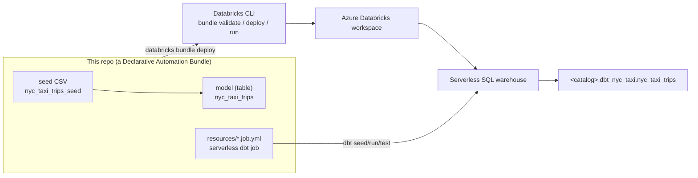

# bricks-cli

A small, end-to-end reference for deploying a [dbt](https://www.getdbt.com/)
project to **Azure Databricks** using the latest **Databricks CLI** and
**Declarative Automation Bundles (DABs)** — the bundle's *direct deployment*
engine, so **no Terraform is required**.

The dbt scope is deliberately tiny so the deployment mechanics stay front and
centre: **one seed → one table.** A 100-row extract of the public
`samples.nyctaxi.trips` table is committed as a dbt seed and materialized into a
Delta table by a single dbt model.

!!! tip "New here? Start with the tutorial."
    The [Tutorial - User Guide](tutorials/index.md) walks you from an empty
    terminal to a dbt job running on Databricks, one small step at a time.

## Find your way around

This documentation follows the [Diátaxis](https://diataxis.fr/) framework. The
four sections answer four different questions, so pick the one that matches what
you need right now.

-   :lucide-graduation-cap: **Tutorial**

    ---

    *Learning-oriented.* A guided, hands-on lesson that takes you from zero to a
    deployed, running dbt job. Start here if you're new.

    [:lucide-arrow-right: Tutorial - User Guide](tutorials/index.md)

-   :lucide-wrench: **How-to guides**

    ---

    *Task-oriented.* Short recipes for specific jobs — run dbt locally, add a
    model, set up CI/CD, deploy to production.

    [:lucide-arrow-right: How-to guides](how-to/index.md)

-   :lucide-book-open: **Reference**

    ---

    *Information-oriented.* The dry facts: CLI commands, bundle fields, the dbt
    job resource, every configuration value, and the project layout.

    [:lucide-arrow-right: Reference](reference/index.md)

-   :lucide-lightbulb: **Explanation**

    ---

    *Understanding-oriented.* The "why" behind the design: bundles, the
    authentication model, how dbt connects, and keeping secrets out of git.

    [:lucide-arrow-right: Explanation](explanation/index.md)

## Is a bundle still the way to go?

**Yes.** Declarative Automation Bundles are the first-party, recommended way to
package and deploy Databricks projects as code. The important 2025–2026 change is
that the latest CLI ships a **direct deployment** engine, so a bundle deploy no
longer shells out to Terraform — exactly what this repo's name asks for. The full
answer, with sources, is in
[Why Declarative Automation Bundles](explanation/why-asset-bundles.md).
