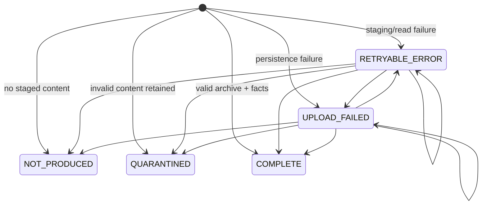

# Capture states

The registry tracks evidence capture and staging cleanup independently. Capture
can be terminal even while cleanup remains pending.

## `capture_status`

| Status | Terminal | Evidence invariant | Scheduled behavior |
|--------|----------|--------------------|--------------------|
| `COMPLETE` | yes, after reconciliation | Hash exists; invocation exists; node-row count equals `total_nodes` | Skip recapture; reconcile pending cleanup |
| `QUARANTINED` | yes, when hash exists | Rejected staged content is retained under `quarantine/` | Skip recapture; reconcile pending cleanup |
| `NOT_PRODUCED` | yes | Instrumented completed attempt had no staged artifact content | Skip recapture; reconcile any residual path |
| `RETRYABLE_ERROR` | no | Staging/discovery read did not produce durable evidence | Retry in a later sweep |
| `UPLOAD_FAILED` | no | Evidence persistence or remote integrity check failed | Retry in a later sweep |

Every newly merged registry row starts with cleanup `PENDING`.

## `staging_cleanup_status`

| Status | Meaning | Related columns |
|--------|---------|-----------------|
| `PENDING` | Terminal capture exists but deletion has not reconciled, or capture is still retryable | Optional `staging_cleanup_error_code`; latest update time |
| `DELETED` | Attempt staging root is absent after idempotent deletion | Error is null; `staging_deleted_at` is populated |

Cleanup is attempted only for terminal `COMPLETE`, `QUARANTINED`, and
`NOT_PRODUCED` rows. Cleanup failure never downgrades terminal evidence.

## Transition contract



Terminal status is not overwritten by ordinary scheduled reconciliation. A
reviewed parser migration is required to reprocess quarantined evidence.

## Collector-run result

Terminal registry state and the current collector-run result are separate:

- the first sweep that records `NOT_PRODUCED` fails so the missing production is
  visible;
- the sweep that writes `QUARANTINED` fails with its validation code;
- any retryable capture or pending cleanup failure fails the sweep;
- any deferred batch work fails the sweep; and
- later sweeps skip terminal attempts and can succeed after cleanup reconciles.

## `evidence_status`

The optional combined `dbt_job_health` view derives:

| Condition | `evidence_status` |
|-----------|-------------------|
| Matching dbt registry row | That row's `capture_status` |
| Native run is terminal, no matching dbt row | `MISSING` |
| Native run is not terminal, no matching dbt row | `PENDING` |

`MISSING` and `PENDING` are view-only evidence states; they are not
`capture_status` values.

## Invocation and node status

Normalized invocation status is `success`, `warning`, or `failed`. Accepted dbt
node statuses are:

```text
success, pass, no-op,
warn, partial success,
error, fail, runtime error,
skipped
```

Unknown node status is quarantined as `UNSUPPORTED_NODE_STATUS`.

