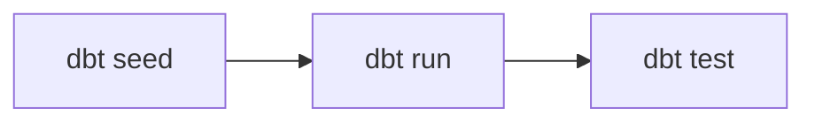

# Deploy and run the job

This is the moment everything has been building toward: you'll **deploy** the
bundle to your workspace and **run** the serverless dbt job that builds your
table.

!!! info "What's a bundle again?"
    A **Declarative Automation Bundle** packages your code *and* the Databricks
    resources that run it (here, one job) as YAML you deploy with
    `databricks bundle`. The latest CLI deploys it **directly through the APIs —
    no Terraform**. More in
    [Why Declarative Automation Bundles](../explanation/why-asset-bundles.md).

## Tell the bundle where to build

The project deliberately contains **no** workspace values. You provide them at
deploy time as `BUNDLE_VAR_*` environment variables, so nothing workspace-specific
is ever committed.

From the repo root:

```bash
export BUNDLE_VAR_warehouse_id="<your-warehouse-id>"   # the SQL warehouse to use
export BUNDLE_VAR_catalog="<your-catalog>"             # the Unity Catalog catalog
export BUNDLE_VAR_schema="dbt_nyc_taxi"                # optional — this is the default
```

!!! tip "Don't know your warehouse ID?"
    List them with the profile you made in the last step:

    ```bash
    databricks warehouses list -p bricks-demo
    ```

    The ID is the short hex string in the first column — the same value that ends
    your warehouse's HTTP path, `/sql/1.0/warehouses/<id>`.

The host and your identity come from the `bricks-demo` profile, so every command
below ends with `-p bricks-demo`.

## Step 1 — Validate

Always start by resolving and type-checking the config for a target:

```bash
databricks bundle validate -t dev -p bricks-demo
```

```console
Name: bricks_cli_dbt
Target: dev
Workspace:
  User: you@example.onmicrosoft.com
  Path: /Workspace/Users/you@example.onmicrosoft.com/.bundle/bricks_cli_dbt/dev

Validation OK!
```

!!! check
    `Validation OK!` confirms the bundle and the `dev` target resolved. One
    caveat: `warehouse_id` and `catalog` have **placeholder defaults**
    (`REPLACE_WITH_YOUR_*`), so a missing `BUNDLE_VAR_*` resolves *silently* to a
    placeholder instead of failing. Confirm your real values took effect by
    grepping the resolved `value` of each variable — its `default` stays
    `REPLACE_WITH_*` even after a correct override, so only the `value` matters:

    ```bash
    databricks bundle validate -t dev -p bricks-demo -o json \
      | grep -E '"value": "REPLACE_WITH_YOUR_' \
      && echo "⚠️  a placeholder is still set — export the missing BUNDLE_VAR_*" \
      || echo "✓ no placeholders left"
    ```

    (`schema` is safe to leave unset — it defaults to `dbt_nyc_taxi`.)

??? info "What is the `dev` target?"
    `dev` uses **development mode**: deployed resources are prefixed with
    `[dev <you>]`, schedules are paused, and copies are easy to find and clean
    up. It's the safe place to iterate. `prod` deploys "for real" — see
    [Deploy to production](../how-to/deploy-to-production.md).

## Step 2 — Deploy

Now upload the files and create the job — **directly through the APIs**:

```bash
databricks bundle deploy -t dev -p bricks-demo
```

```console
Uploading bundle files to /Workspace/Users/you@.../.bundle/bricks_cli_dbt/dev/files...
Deploying resources...
Deployment complete!
```

Your job now exists in the workspace as `[dev you] nyc_taxi_dbt_job`, with its
schedule paused so nothing runs until you ask.

## Step 3 — Run

Time to build the table. Trigger the job and wait for it:

```bash
databricks bundle run nyc_taxi_dbt_job -t dev -p bricks-demo
```

The job runs three dbt commands in order, on serverless compute:



When it finishes you'll see a terminal state of **`TERMINATED` / `SUCCESS`** and
a run URL you can open in the workspace.

!!! check "You did it"
    A successful run means the seed loaded, the `nyc_taxi_trips` table built, and
    the `not_null` tests passed — end to end, on Databricks.

## Step 4 — See the result

The job built `<your-catalog>.dbt_nyc_taxi.nyc_taxi_trips`. Peek at it from
the CLI:

```bash
databricks api post /api/2.0/sql/statements -p bricks-demo --json '{
  "warehouse_id": "<your-warehouse-id>",
  "catalog": "<your-catalog>",
  "schema": "dbt_nyc_taxi",
  "statement": "select count(*) as rows, round(avg(trip_minutes), 2) as avg_min from nyc_taxi_trips"
}'
```

You should get back **100 rows** and an average trip length of roughly **26
minutes** — the same numbers this demo was verified with.

!!! tip
    Prefer a UI? Open the table in **Catalog Explorer**, or run the query in a
    **SQL editor** tab in the workspace.

## Clean up (optional)

When you're done experimenting, tear the `dev` deployment down:

```bash
databricks bundle destroy -t dev -p bricks-demo
```

## Recap and next steps

Congratulations — you've completed the tutorial! You:

- [x] supplied workspace values as `BUNDLE_VAR_*` (never committed),
- [x] **validated** and **deployed** the bundle with no Terraform,
- [x] **ran** the serverless dbt job to `TERMINATED SUCCESS`, and
- [x] **queried** the resulting Delta table.

Where to go next:

<div class="grid cards" markdown>

-   :lucide-wrench: **Make it yours**

    ---

    Iterate locally, then add your own models.

    [:lucide-arrow-right: Run dbt locally](../how-to/run-dbt-locally.md) ·
    [Add a model](../how-to/add-a-model.md)

-   :lucide-shield-check: **Automate it**

    ---

    Deploy from GitHub with no stored secrets.

    [:lucide-arrow-right: Set up CI/CD with OIDC](../how-to/set-up-oidc-cicd.md)

-   :lucide-book-open: **Look things up**

    ---

    Every command, field, and config value.

    [:lucide-arrow-right: Reference](../reference/index.md)

-   :lucide-lightbulb: **Understand the design**

    ---

    Why bundles, how auth works, how dbt connects.

    [:lucide-arrow-right: Explanation](../explanation/index.md)

</div>
