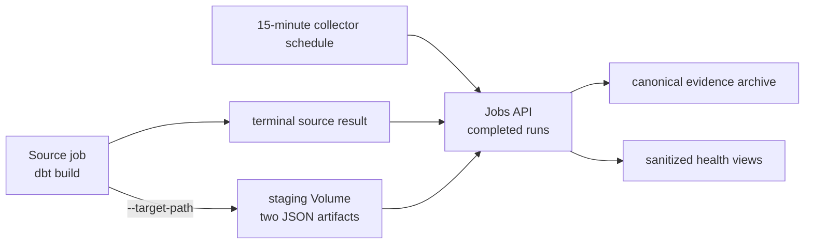

# Deploy and run the job

This is the moment everything has been building toward: you'll **deploy** the
bundle to your workspace and **run** the serverless dbt job that builds your
table.

!!! info "What's a bundle again?"
    A **Declarative Automation Bundle** packages your code *and* the Databricks
    resources that run it (here, a source job and a collector job) as YAML you
    deploy with
    `databricks bundle`. The latest CLI deploys it **directly through the APIs —
    no Terraform**. More in
    [Why Declarative Automation Bundles](../explanation/why-asset-bundles.md).

## Tell the bundle where to build

You provide the workspace values at deploy time as `BUNDLE_VAR_*` environment
variables, so you can point the same project at any workspace.

From the repo root:

```bash
export BUNDLE_VAR_warehouse_id="<your-warehouse-id>"   # the SQL warehouse to use
export BUNDLE_VAR_catalog="<your-catalog>"             # the Unity Catalog catalog
export BUNDLE_VAR_schema="dbt_nyc_taxi_dev"            # isolate dev data
export BUNDLE_VAR_observability_schema="dbt_observability"
export BUNDLE_VAR_observability_staging_volume="dbt_artifacts_staging"
export BUNDLE_VAR_observability_volume="dbt_artifacts"
```

!!! tip "Don't know your warehouse ID?"
    List them with the profile you made in the last step:

    ```bash
    databricks warehouses list -p bricks-demo
    ```

    The ID is the short hex string in the first column — the same value that ends
    your warehouse's HTTP path, `/sql/1.0/warehouses/<id>`.

The host and your identity come from the `bricks-demo` profile, so every command
below ends with `-p bricks-demo`.

## Step 1 — Validate

Always start by resolving and type-checking the config for a target:

```bash
databricks bundle validate -t dev -p bricks-demo
```

```console
Name: bricks_cli_dbt
Target: dev
Workspace:
  User: you@example.onmicrosoft.com
  Path: /Workspace/Users/you@example.onmicrosoft.com/.bundle/bricks_cli_dbt/dev

Validation OK!
```

!!! check
    `Validation OK!` confirms the bundle and the `dev` target resolved. One
    caveat: `warehouse_id` and `catalog` have **placeholder defaults**
    (`REPLACE_WITH_YOUR_*`), so a missing `BUNDLE_VAR_*` resolves *silently* to a
    placeholder instead of failing. Confirm your real values took effect by
    grepping the resolved `value` of each variable — its `default` stays
    `REPLACE_WITH_*` even after a correct override, so only the `value` matters:

    ```bash
    if config="$(databricks bundle validate -t dev -p bricks-demo -o json)"; then
      printf '%s' "$config" | grep -q '"value": "REPLACE_WITH_YOUR_' \
        && echo "⚠️  a placeholder is still set — export the missing BUNDLE_VAR_*" \
        || echo "✓ no placeholders left"
    else
      echo "✗ validate failed — fix the errors above first"
    fi
    ```

    (`schema` is safe to leave unset — it defaults to `dbt_nyc_taxi`.)

??? info "What is the `dev` target?"
    `dev` uses **development mode**: deployed resources are prefixed with
    `[dev <you>]` and schedules are paused, so the dev *jobs* stay separate from
    prod and are easy to clean up. Dev mode isolates the job resources, not the
    data — the dbt task writes to whatever catalog/schema you supply, so point dev
    and prod at different schemas (or override `BUNDLE_VAR_schema` per target) to
    keep their tables apart. `prod` deploys "for real" — see
    [Deploy to production](../how-to/deploy-to-production.md).

## Step 2 — Deploy

Now upload the files and create both jobs — **directly through the APIs**:

```bash
databricks bundle deploy -t dev -p bricks-demo
```

```console
Uploading bundle files to /Workspace/Users/you@.../.bundle/bricks_cli_dbt/dev/files...
Deploying resources...
Deployment complete!
```

Two jobs now exist in the workspace: the source dbt job and the independent
artifact collector. Development mode pauses both schedules, so nothing runs
until you ask. The bundle also creates
a development-prefixed observability schema plus restricted staging and
evidence managed Volumes.
Read the exact schema name from `databricks bundle summary -t dev`; the
collector creates the Delta tables and views there on the first run.

## Step 3 — Run

Time to build the table. Trigger the job and wait for it:

```bash
databricks bundle run nyc_taxi_dbt_job -t dev -p bricks-demo
```

The source job runs one dbt invocation on serverless compute. After it reaches a
terminal state, run the separately deployed collector job; production does this
automatically every 15 minutes:



When the source job finishes you'll see a terminal state of **`TERMINATED` /
`SUCCESS`** and a run URL you can open in the workspace.

!!! check "You did it"
    A successful run means the seed loaded, the `nyc_taxi_trips` table built, and
    the `not_null` tests passed. This result belongs only to dbt; artifact
    collection is verified separately.

Run the paused development collector after the source run finishes:

```bash
databricks bundle run dbt_observability_collector_job -t dev -p bricks-demo
```

The collector scans completed source runs, reconciles each full attempt-key
staging leaf, and packages `manifest.json` plus `run_results.json` into a
deterministic content-addressed archive. It deletes staging only after durable
capture. Its failure indicates capture or cleanup work; it does not change the
source dbt result.

## Step 4 — See the result

The job built `<your-catalog>.dbt_nyc_taxi_dev.nyc_taxi_trips`. Peek at it from
the CLI:

```bash
databricks api post /api/2.0/sql/statements -p bricks-demo --json '{
  "warehouse_id": "<your-warehouse-id>",
  "catalog": "<your-catalog>",
  "schema": "dbt_nyc_taxi_dev",
  "statement": "select count(*) as rows, round(avg(trip_minutes), 2) as avg_min from nyc_taxi_trips"
}'
```

For this seed you should get back **100 rows** and an average trip length of
roughly **26 minutes**.

!!! tip
    Prefer a UI? Open the table in **Catalog Explorer**, or run the query in a
    **SQL editor** tab in the workspace.

## Step 5 — See the job health

In a Databricks SQL editor, query the sanitized invocation view:

```sql
SELECT
  generated_at,
  upstream_result_state,
  capture_status,
  invocation_status,
  elapsed_seconds,
  total_nodes,
  failed_nodes
FROM `<your-catalog>`.`<observability-schema-from-bundle-summary>`.`dbt_run_health`
ORDER BY generated_at DESC
LIMIT 10;
```

The result should contain one `COMPLETE` capture. The runbook explains the
restricted raw archive, Lakeflow join, node drill-down, access grants, and a safe
forced-failure check: [Observe dbt jobs](../how-to/observe-dbt-jobs.md).

## Clean up (optional)

The collector-created Delta objects must be removed before the bundle-owned
schema and its staging/evidence Volumes. Follow the exact, target-scoped
sequence in
[Clean up an isolated dev validation](../how-to/observe-dbt-jobs.md#clean-up-an-isolated-dev-validation).

## Recap and next steps

Congratulations — you've completed the tutorial! You:

- [x] supplied workspace values as `BUNDLE_VAR_*` environment variables,
- [x] **validated** and **deployed** the bundle with no Terraform,
- [x] **ran** the serverless dbt job to `TERMINATED SUCCESS`, and
- [x] **ran** the independent collector after the source run completed, and
- [x] **queried** the resulting Delta table and sanitized dbt health evidence.

Where to go next:

<div class="grid cards" markdown>

-   :lucide-wrench: **Make it yours**

    ---

    Iterate locally, then add your own models.

    [:lucide-arrow-right: Run dbt locally](../how-to/run-dbt-locally.md) ·
    [Add a model](../how-to/add-a-model.md)

-   :lucide-shield-check: **Automate it**

    ---

    Deploy from GitHub Actions using OIDC.

    [:lucide-arrow-right: Set up CI/CD with OIDC](../how-to/set-up-oidc-cicd.md)

-   :lucide-book-open: **Look things up**

    ---

    Every command, field, and config value.

    [:lucide-arrow-right: Reference](../reference/index.md)

-   :lucide-lightbulb: **Understand the design**

    ---

    Why bundles, how auth works, how dbt connects.

    [:lucide-arrow-right: Explanation](../explanation/index.md)

</div>
