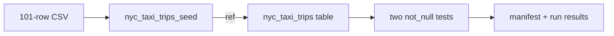

# Explore the dbt project

Before we deploy, we will follow one row of data through the small dbt project.
The project deliberately contains one seed, one table model, and two data tests
so the deployment and observability mechanics remain visible.

## See the project files

From the repository root, list the dbt files:

```bash
find src/models src/seeds -type f | sort
```

You should see these four paths:

```text
src/models/nyc_taxi/nyc_taxi_trips.sql
src/models/nyc_taxi/schema.yml
src/seeds/nyc_taxi/nyc_taxi_trips_seed.csv
src/seeds/nyc_taxi/properties.yml
```

The project configuration is the fifth dbt file we will inspect. It lives at
the repository root as `dbt_project.yml`.

## Inspect the seed

Show the header and first two data rows:

```bash
sed -n '1,3p' src/seeds/nyc_taxi/nyc_taxi_trips_seed.csv
```

The output begins like this:

```csv
tpep_pickup_datetime,tpep_dropoff_datetime,trip_distance,fare_amount,pickup_zip,dropoff_zip
2016-01-01 00:04:30,2016-01-01 00:07:42,0.77,5.0,11217,11231
2016-01-01 00:11:29,2016-01-01 00:30:42,7.75,24.5,10002,10025
```

Count the lines:

```bash
wc -l src/seeds/nyc_taxi/nyc_taxi_trips_seed.csv
```

The result is `102`: one header plus 101 taxi trips. Because the CSV is
committed, the tutorial does not download data from an external service.

## Inspect the model

Print the model SQL:

```bash
sed -n '1,120p' src/models/nyc_taxi/nyc_taxi_trips.sql
```

Find these two expressions in the output:

```sql
{{ config(materialized = 'table') }}
...
from {{ ref('nyc_taxi_trips_seed') }}
```

The first expression makes a Delta table. The second uses dbt's
[`ref()` function](https://docs.getdbt.com/reference/dbt-jinja-functions/ref)
to resolve the seed and record the dependency. dbt can therefore build the seed
before the model without a hard-coded catalog or schema name.

The model also derives `trip_minutes` from the pickup and drop-off timestamps.

## Inspect the tests

Print the model properties:

```bash
sed -n '1,160p' src/models/nyc_taxi/schema.yml
```

You should find one `not_null` data test for `pickup_at` and another for
`dropoff_at`. The deployed command uses
[`dbt build`](https://docs.getdbt.com/reference/commands/build), so the seed,
model, and selected tests run in dependency order within one dbt invocation.

## Check the privacy default

Show the project flags:

```bash
sed -n '1,24p' dbt_project.yml
```

The output includes:

```yaml
flags:
  send_anonymous_usage_stats: false
```

This disables dbt anonymous usage events. The deployed workload will still
write its local dbt artifacts inside Databricks for the independent collector.

## Follow the graph

The complete build graph is:



You have now inspected every resource the source job will build.

[:lucide-arrow-right: Deploy and run the source job](deploy-and-run.md){ .md-button .md-button--primary }
