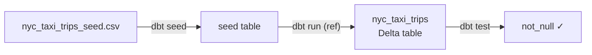

# Explore the dbt project

Before you deploy anything, let's look at **what** you're deploying. The whole
point of this demo is to keep dbt tiny — **one seed, one table** — so the
deployment mechanics stay in focus.

!!! info "What is dbt here?"
    dbt turns `SELECT` statements into tables and views in your warehouse. This
    project uses the official **`dbt-databricks`** adapter, which builds objects
    in Unity Catalog (`catalog.schema.object`). The deeper picture is in
    [How dbt connects to Databricks](../explanation/how-dbt-connects.md).

## The pieces

Everything dbt-related lives under `src/`, so the dbt code and the bundle's
Databricks resources can share one repository:

```text
dbt_project.yml                      # project name, profile, paths, seed/model config
src/
├── seeds/nyc_taxi/
│   ├── nyc_taxi_trips_seed.csv      # 100 rows from samples.nyctaxi.trips
│   └── properties.yml               # column docs for the seed
└── models/nyc_taxi/
    ├── nyc_taxi_trips.sql           # the one table model
    └── schema.yml                   # model docs + tests
```

Two files do the real work: the **seed CSV** and the **model SQL**. Let's read
them.

## Step 1 — The seed

A *seed* is just a CSV that dbt loads into your warehouse with `dbt seed`. From
the repo root, look at the top of the file:

```bash
head -3 src/seeds/nyc_taxi/nyc_taxi_trips_seed.csv
```

You'll see a header row and the first two trips:

```csv
tpep_pickup_datetime,tpep_dropoff_datetime,trip_distance,fare_amount,pickup_zip,dropoff_zip
2016-01-01 00:04:30,2016-01-01 00:07:42,0.77,5.0,11217,11231
2016-01-01 00:11:29,2016-01-01 00:30:42,7.75,24.5,10002,10025
```

Confirm the whole seed is there:

```bash
wc -l src/seeds/nyc_taxi/nyc_taxi_trips_seed.csv
```

```console
101 src/seeds/nyc_taxi/nyc_taxi_trips_seed.csv
```

That's 100 trips plus the header row.

So the raw data lands well-typed, the column types are declared in
`dbt_project.yml`:

```yaml title="dbt_project.yml" hl_lines="6 7"
seeds:
  bricks_cli_dbt:
    nyc_taxi:
      nyc_taxi_trips_seed:
        +column_types:
          tpep_pickup_datetime: timestamp
          tpep_dropoff_datetime: timestamp
          trip_distance: double
          fare_amount: double
          pickup_zip: int
          dropoff_zip: int
```

!!! tip "Why bother typing a seed?"
    Without `+column_types`, a CSV loads as all-strings. Declaring types means
    the model downstream can rely on real `timestamp` and `double` columns
    instead of casting from text every time.

## Step 2 — The table

Now the one model. Print it:

```bash
cat src/models/nyc_taxi/nyc_taxi_trips.sql
```

It reads the seed and materializes a **real Delta table**, adding a derived
`trip_minutes` column:

```sql title="src/models/nyc_taxi/nyc_taxi_trips.sql"
{{ config(materialized = 'table') }}

with source as (

    select * from {{ ref('nyc_taxi_trips_seed') }}

)

select
    cast(tpep_pickup_datetime  as timestamp) as pickup_at,
    cast(tpep_dropoff_datetime as timestamp) as dropoff_at,
    cast(trip_distance         as double)    as trip_distance,
    cast(fare_amount           as double)    as fare_amount,
    cast(pickup_zip            as int)       as pickup_zip,
    cast(dropoff_zip           as int)       as dropoff_zip,
    round(
        timestampdiff(SECOND, tpep_pickup_datetime, tpep_dropoff_datetime) / 60.0,
        2
    ) as trip_minutes

from source
```

Two lines deserve a closer look:

- `{{ config(materialized = 'table') }}` tells dbt to build a **table** (not a
  view). That's the "move the seed into a table" goal from the project's brief.
- `{{ ref('nyc_taxi_trips_seed') }}` is how dbt links models together. `ref()`
  resolves a resource **by name** and, as a bonus, builds the dependency graph so
  the seed always loads before the model runs.

!!! note "Why are the names different?"
    The seed is `nyc_taxi_trips_seed` and the model is `nyc_taxi_trips`. dbt
    resource names must be unique, and `ref()` resolves by name — so the seed and
    the table it feeds can't share one name.

## Step 3 — The tests

`schema.yml` documents the model's columns and adds two `not_null` tests that
`dbt test` checks after the build:

```yaml title="src/models/nyc_taxi/schema.yml"
models:
  - name: nyc_taxi_trips
    columns:
      - name: pickup_at
        data_tests:
          - not_null
      - name: dropoff_at
        data_tests:
          - not_null
```

!!! check "Tests are part of the pipeline"
    The deployed job runs `dbt test` right after `dbt run`, so a broken
    assumption fails the job instead of quietly shipping bad data.

## The pipeline in one line

That's the entire data flow:



## Recap

You've now seen the whole project:

- [x] a **seed** CSV with declared column types,
- [x] one **model** that turns the seed into a Delta table via `ref()`, and
- [x] **tests** that run after the build.

The model code names no specific workspace, warehouse, or catalog — those come
from *outside* the code, supplied at deploy time. Time to deploy it.

[:lucide-arrow-right: Deploy and run the job](deploy-and-run.md){ .md-button .md-button--primary }
