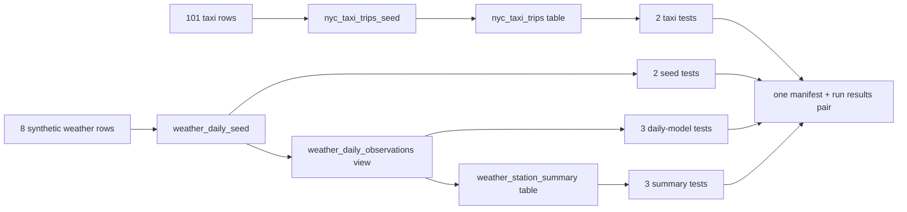

# Explore the dbt project

Before we deploy, we will follow one taxi row through the first small graph,
then inspect a second synthetic weather graph. Keeping both topics in one dbt
invocation makes the later observability difference easy to see.

## See the project files

From the repository root, list the dbt files:

```bash
find src/models src/seeds src/tests -type f ! -name '.gitkeep' | sort
```

You should see these paths:

```text
src/models/nyc_taxi/nyc_taxi_trips.sql
src/models/nyc_taxi/schema.yml
src/models/weather/schema.yml
src/models/weather/weather_daily_observations.sql
src/models/weather/weather_station_summary.sql
src/seeds/nyc_taxi/nyc_taxi_trips_seed.csv
src/seeds/nyc_taxi/properties.yml
src/seeds/weather/properties.yml
src/seeds/weather/weather_daily_seed.csv
src/tests/weather_daily_observation_ranges.sql
src/tests/weather_station_summary_invariants.sql
```

The root project configuration lives in `dbt_project.yml`.

## Inspect the seed

Show the header and first two data rows:

```bash
sed -n '1,3p' src/seeds/nyc_taxi/nyc_taxi_trips_seed.csv
```

The output begins like this:

```csv
tpep_pickup_datetime,tpep_dropoff_datetime,trip_distance,fare_amount,pickup_zip,dropoff_zip
2016-01-01 00:04:30,2016-01-01 00:07:42,0.77,5.0,11217,11231
2016-01-01 00:11:29,2016-01-01 00:30:42,7.75,24.5,10002,10025
```

Count the lines:

```bash
wc -l src/seeds/nyc_taxi/nyc_taxi_trips_seed.csv
```

The result is `102`: one header plus 101 taxi trips. Because the CSV is
committed, the tutorial does not download data from an external service.

## Inspect the model

Print the model SQL:

```bash
sed -n '1,120p' src/models/nyc_taxi/nyc_taxi_trips.sql
```

Find these two expressions in the output:

```sql
{{ config(materialized = 'table') }}
...
from {{ ref('nyc_taxi_trips_seed') }}
```

The first expression makes a Delta table. The second uses dbt's
[`ref()` function](https://docs.getdbt.com/reference/dbt-jinja-functions/ref)
to resolve the seed and record the dependency. dbt can therefore build the seed
before the model without a hard-coded catalog or schema name.

The model also derives `trip_minutes` from the pickup and drop-off timestamps.

## Inspect the tests

Print the model properties:

```bash
sed -n '1,160p' src/models/nyc_taxi/schema.yml
```

You should find one `not_null` data test for `pickup_at` and another for
`dropoff_at`. The deployed command uses
[`dbt build`](https://docs.getdbt.com/reference/commands/build), so the seed,
model, and selected tests run in dependency order within one dbt invocation.

## Inspect the weather graph

The weather seed is explicitly synthetic. Print its metadata and both models:

```bash
sed -n '1,160p' src/seeds/weather/properties.yml
sed -n '1,200p' src/models/weather/weather_daily_observations.sql
sed -n '1,200p' src/models/weather/weather_station_summary.sql
sed -n '1,240p' src/models/weather/schema.yml
sed -n '1,200p' src/tests/weather_daily_observation_ranges.sql
sed -n '1,240p' src/tests/weather_station_summary_invariants.sql
```

The first model has one row per station and date. The second aggregates those
rows to one row per station. Their schema and singular tests check keys, nulls,
ranges, and reconciliation without downloading data at run time.

## Check the privacy default

Show the project flags:

```bash
sed -n '1,24p' dbt_project.yml
```

The output includes:

```yaml
flags:
  send_anonymous_usage_stats: false
```

This disables dbt anonymous usage events. The deployed workload will still
write its local dbt artifacts inside Databricks for the independent collector.

## Follow the graph

The complete build graph is:



You have now inspected every resource the source job will build.

[:lucide-arrow-right: Deploy and run the source job](deploy-and-run.md){ .md-button .md-button--primary }
