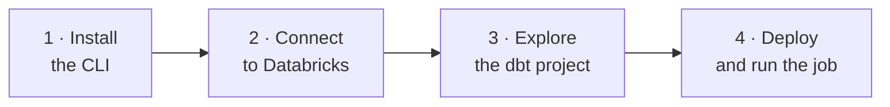

# Tutorial - User Guide

This tutorial shows you how to use **bricks-cli** to deploy a dbt project to
Azure Databricks, **step by step**.

Each section builds gently on the previous ones, but they're grouped around
single topics, so you can jump straight to whatever you need.

By the end you will have:

- the latest **Databricks CLI** installed and talking to a workspace,
- a tiny dbt project (**one seed → one table**) deployed as a
  **Declarative Automation Bundle**, and
- a serverless job that runs `dbt seed`, `dbt run`, and `dbt test` for you —
  finishing with a real Delta table you can query.

No Terraform, and no secrets committed to git.

## Run the code

Every code example is something you can copy and run yourself. In fact, that's
the best way to learn this: type it out, run it, and watch what happens.

!!! tip
    Having the project open in one window and this tutorial in another makes it
    much easier to follow along.

## What you'll need

Before you start, make sure you have:

- [x] A **terminal** (macOS, Linux, or WSL on Windows).
- [x] **Python 3.10+** — used only to run dbt locally and, optionally, to build
      these docs.
- [x] Access to an **Azure Databricks workspace** with a **SQL warehouse** and a
      **Unity Catalog** catalog you can write to.
- [x] The **Azure CLI** (`az`) signed in to the subscription that owns the
      workspace. This tutorial uses it for password-free authentication.

!!! info "You don't need to memorize anything"
    If a term is new — *bundle*, *target*, *serverless* — keep going. Each one is
    introduced where you first meet it, and the
    [Explanation](../explanation/index.md) section has the deeper "why" once
    you're curious.

## The shape of the journey

1. [**Install the Databricks CLI**](install-the-cli.md) — get the single binary
   that drives everything.
2. [**Connect to Databricks**](connect-to-databricks.md) — authenticate with the
   Azure CLI, no tokens to store.
3. [**Explore the dbt project**](explore-the-project.md) — see how a seed becomes
   a table before you deploy anything.
4. [**Deploy and run the job**](deploy-and-run.md) — ship the bundle and watch
   the job build your table.

Ready? Let's [install the CLI](install-the-cli.md).
