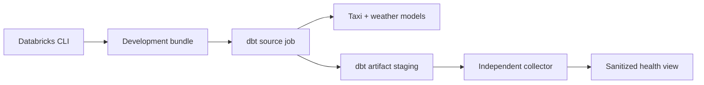

# Tutorial: deploy and observe a dbt job

In this tutorial, we will deploy the repository's dbt Core project to a
Databricks Free Edition workspace on AWS. We will run the dbt source job, run
its independent artifact collector, and confirm that Databricks contains both
the model output and a sanitized health record.

The completed path looks like this:

By the end, you will have:

- authenticated the CLI with browser-based OAuth user-to-machine (U2M),
- deployed two paused development jobs and governed Unity Catalog storage,
- built two seeds, three models, and ten data tests with dbt Core,
- captured `manifest.json` and `run_results.json` without an external telemetry
  platform, and
- removed every tutorial object again.

## What you need

This tutorial follows one tested path. Start with:

- macOS with [Homebrew](https://brew.sh/) and Git installed;
- an AWS Databricks Free Edition workspace;
- a SQL warehouse;
- a Unity Catalog catalog where your user can create a schema and managed
  Volumes; and
- permission to create and run workspace jobs.

!!! warning "Free Edition is a learning environment"
    Free Edition has no compliance enforcement, security customization,
    private networking, support guarantee, or SLA. Use it to learn and validate
    this reference implementation, not as a regulated production environment.
    Use only the repository's public demonstration dataset—never Personal Data,
    confidential, proprietary, or regulated data. Databricks states that Free
    Edition is for exploratory datasets and reserves the right to train on
    uploaded data.
    See the official
    [Free Edition comparison](https://docs.databricks.com/aws/en/getting-started/free-trial-vs-free-edition).

## The journey

Follow these pages in order:

1. [Install the Databricks CLI](install-the-cli.md).
2. [Connect to Databricks](connect-to-databricks.md).
3. [Explore the dbt project](explore-the-project.md).
4. [Deploy and run the source job](deploy-and-run.md).
5. [Observe your first run](observe-your-first-run.md).
6. [Clean up the tutorial](clean-up-the-tutorial.md).

We will use the same terminal, profile, catalog, warehouse, and bundle-variable
values throughout. Keep the terminal open so the exported values remain set.

[:lucide-arrow-right: Install the Databricks CLI](install-the-cli.md){ .md-button .md-button--primary }
